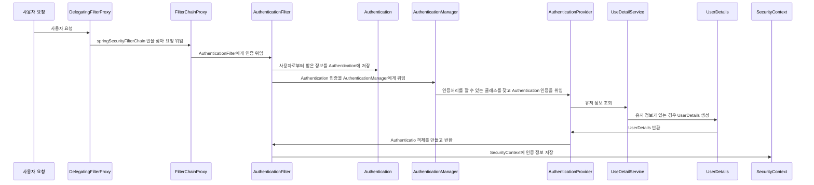
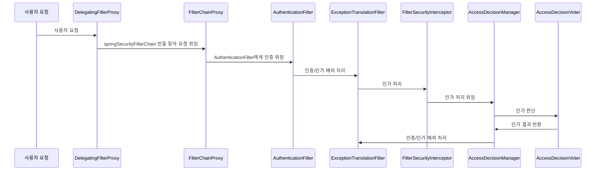

# Spring Security Fundamentals
## 초기화 과정 이해 - SecurityBuilder / SecurityConfigurer
### 개념 및 구조 이해
* SecurityBuilder는 빌더 클래스로서 웹 보안을 구성하는 빈 객체와 설정 클래스들을 생성하는 역할을 하며 WebSecurity, HttpSecurity가 있다.
* SecurityConfigurer는 Http 요청과 관련된 보안처리를 담당하는 필터들을 생성하고 여러 초기화 설정에 관여한다.
* SecurityBuilder는 SecurityConfigurer를 포함하고 있으며 인증 및 인가 초기화 작업은 SecurityConfigurer에 의해 진행된다.

### 자동설정에 의한 초기화 과정 이해
1. SpringWebMvcImportSelector 로드 (WebMvcSecurityConfiguration)
2. SecurityFilterAutoConfiguration 로드 (DelegatingFilterProxyRegistrationBean 생성 - DelegatingFilterProxy 등록("springSecurityFilterChain" 이름의 빈을 검색))
3. WebMvcSecurityConfiguration 로드 
   * AuthenticationPrincipalArgumentResolver 생성 - @AuthenticationPrincipal로 Principal 객체 바인딩
   * CurrentSecurityContextArgumentResolver 생성
   * CsrfTokenArgumentResolver 생성
4. HttpSecurity: 공통 설정 클래스와 필터들을 생성하고 최종적으로 SecurityFilterChain 빈 반환 
5. SpringBootWebSecurityConfiguration
6. WebSecurityConfiguration

* WebSecurity는 설정클래스에서 정의한 SecurityFilterChain 빈을 SecurityBuilder에 저장한다.
* WebSecurity가 build()를 실행하면 SecurityBuilder에서 SecurityFilterChain을 꺼내어 FilterChainProxy 생성자에게 전달한다.

#### 사용자 정의 설정 클래스
* 설정 클래스를 커스텀하게 생성하기 때문에 SpringBootWebSecurityConfiguration의 SecurityFilterChainConfiguration 클래스가 구동되지 않는다.
* 사용자 정의 클래스 생성시 SecurityFilterChain과 WebSecurityConfigurationAdapter 두 가지 방식 모두 설정할 수 없으며 하나만 정의해야 한다.

### AuthenticationEntryPoint 이해
* Spring Security는 초기화때 인증방식 2개(formLogin, httpBasic)를 설정한다.
* 인증 예외 발생시 `ExceptionHandlingConfigurer`가 `AuthenticationEntryPoint` 클래스를 통해서 처리한다.
* 커스텀 엔트리포인트가 생성되면 formLogin, httpBasic의 defaultEntryPoint 보다 우선 적용된다.

### 시큐리티 인증 및 인가 흐름 요약
* 인증

* 인가
