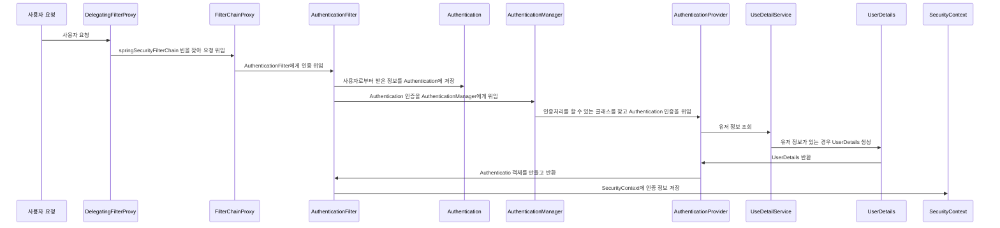
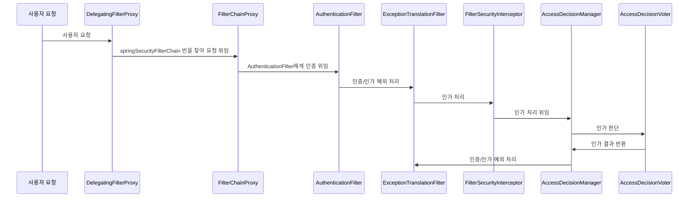
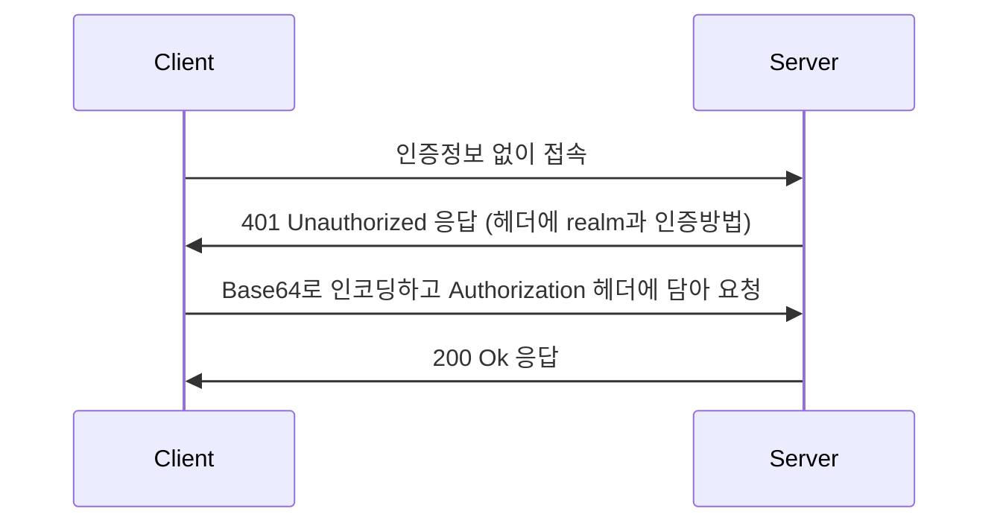
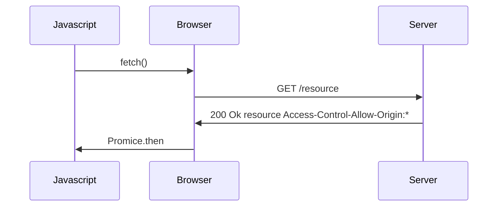
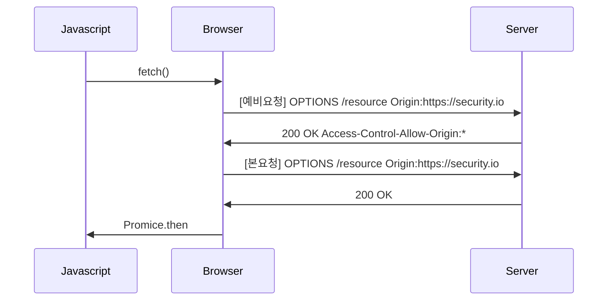
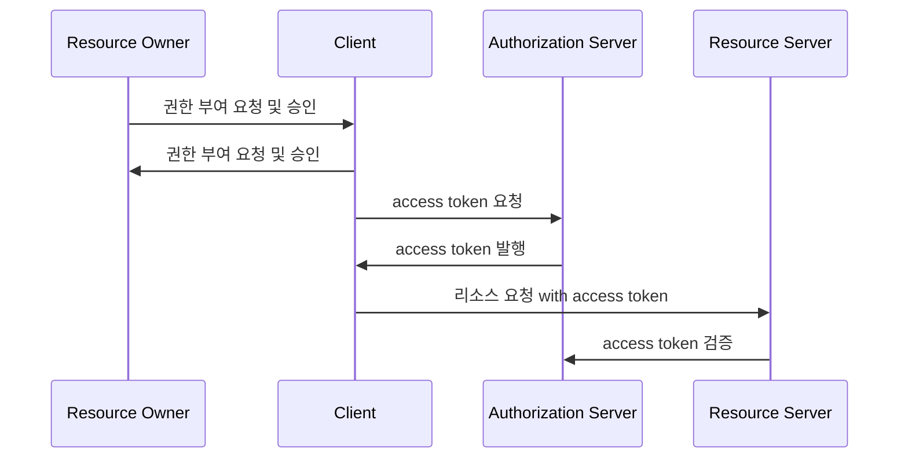
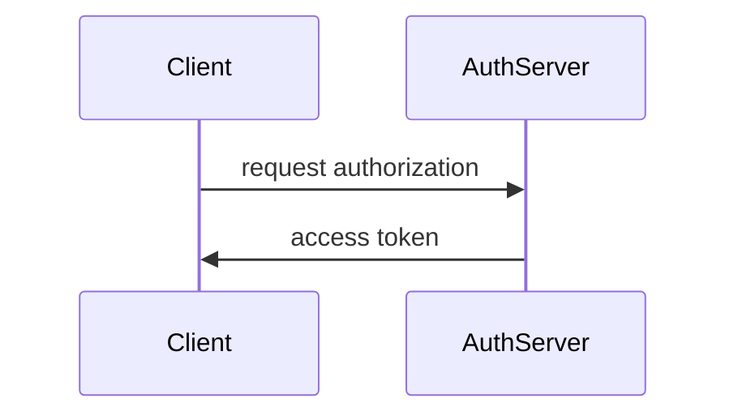
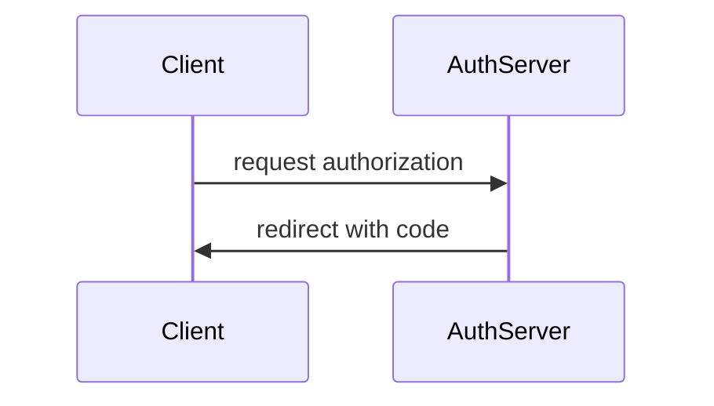
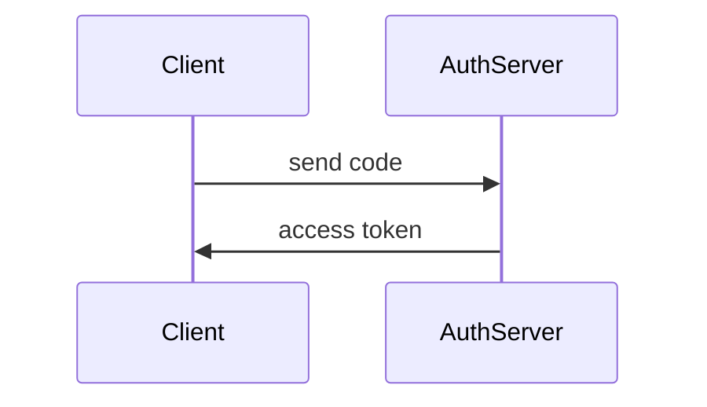

# Spring Security Fundamentals
## 초기화 과정 이해 - SecurityBuilder / SecurityConfigurer
### 개념 및 구조 이해
* SecurityBuilder는 빌더 클래스로서 웹 보안을 구성하는 빈 객체와 설정 클래스들을 생성하는 역할을 하며 WebSecurity, HttpSecurity가 있다.
* SecurityConfigurer는 Http 요청과 관련된 보안처리를 담당하는 필터들을 생성하고 여러 초기화 설정에 관여한다.
* SecurityBuilder는 SecurityConfigurer를 포함하고 있으며 인증 및 인가 초기화 작업은 SecurityConfigurer에 의해 진행된다.

### 자동설정에 의한 초기화 과정 이해
1. SpringWebMvcImportSelector 로드 (WebMvcSecurityConfiguration)
2. SecurityFilterAutoConfiguration 로드 (DelegatingFilterProxyRegistrationBean 생성 - DelegatingFilterProxy 등록("springSecurityFilterChain" 이름의 빈을 검색))
3. WebMvcSecurityConfiguration 로드 
   * AuthenticationPrincipalArgumentResolver 생성 - @AuthenticationPrincipal로 Principal 객체 바인딩
   * CurrentSecurityContextArgumentResolver 생성
   * CsrfTokenArgumentResolver 생성
4. HttpSecurity: 공통 설정 클래스와 필터들을 생성하고 최종적으로 SecurityFilterChain 빈 반환 
5. SpringBootWebSecurityConfiguration
6. WebSecurityConfiguration

* WebSecurity는 설정클래스에서 정의한 SecurityFilterChain 빈을 SecurityBuilder에 저장한다.
* WebSecurity가 build()를 실행하면 SecurityBuilder에서 SecurityFilterChain을 꺼내어 FilterChainProxy 생성자에게 전달한다.

#### 사용자 정의 설정 클래스
* 설정 클래스를 커스텀하게 생성하기 때문에 SpringBootWebSecurityConfiguration의 SecurityFilterChainConfiguration 클래스가 구동되지 않는다.
* 사용자 정의 클래스 생성시 SecurityFilterChain과 WebSecurityConfigurationAdapter 두 가지 방식 모두 설정할 수 없으며 하나만 정의해야 한다.

### AuthenticationEntryPoint 이해
* Spring Security는 초기화때 인증방식 2개(formLogin, httpBasic)를 설정한다.
* 인증 예외 발생시 `ExceptionHandlingConfigurer`가 `AuthenticationEntryPoint` 클래스를 통해서 처리한다.
* 커스텀 엔트리포인트가 생성되면 formLogin, httpBasic의 defaultEntryPoint 보다 우선 적용된다.

## 시큐리티 인증 및 인가 흐름 요약
* 인증


* 인가


## Http Basic 인증

* base64 인코딩된 값은 쉽게 디코딩이 가능하기 때문에 인증정보가 노출된다.
* Http Basic 인증은 반드시 HTTPS와 같이 TLS 기술과 함께 사용해야 한다.

### HttpBasicConfigurer
* HttpBasic 인증에 대한 초기화를 진행하며 속성들에 대한 기본값들을 설정한다.
* 기본 AuthenticationEntryPoint는 BasicAuthenticationEntryPoint다.
* 필터는 BasicAuthenticationFilter를 사용한다.

### BasicAuthenticationFilter
* 이 필터는 기본 인증 서비스를 제공하는 데 사용된다.
* BasicAuthenticationConverter를 사용해서 요청 헤더에 기술된 인증정보의 유효성을 체크하며 Base64 인코딩된 username과 password를 추출한다.
* 인증이 성공하면 Authentication이 SecurityContext에 저장되고 인증이 실패하면 Basic 인증을 통해 다시 인증하라는 메시지를 표시하는 BasicAuthenticationEntryPoint가 호출된다.
* 인증 이후 세션을 사용하는 경우와 사용하지 않는 경우에 따라 처리되는 흐름에 차이가 있다. 세션을 사용하는 경우 매 요청 마다 인증과정을 거치지 않으나 세션을 사용하지 않는 경우 매 요청마다 인증과정을 거쳐야 한다.

### API
```java
protected void configure(final HttpSecurity http) throws Exception {
    http.authorizeRequests()
         .anyRequest().authenticated()
            .and()
            .httpBasic()
            .authenticationEntryPoint(new CustomAuthenticationEntryPoint());
}
```
## Cors 이해
Cross-Origin Resource Sharing, 교차 출처 리소스 공유
* HTTP 헤더를 사용하여, 한 출처에서 실행 중인 웹 애플리케이션이 다른 출처의 선택한 자원에 접근할 수 있는 권한을 부여하도록 브라우저에 알려주는 체제
* 웹 애플리케이션이 리소스가 자신의 출처와 다를 때 브라우저는 요청 헤더에 Origin 필드에 요청을 출처를 함께 담아 교차 출처 HTTP 요청을 실행한다.
* 출처를 비교하는 로직은 서버에 구현된 스펙이 아닌 브라우저에 구현된 스펙 기준으로 처리되며 브라우저는 클라이언트의 요청 헤더와 서버의 응답헤더를 비교해서 최종 응답을 결정한다.
* 두 개의 출처를 비교하는 방법은 URL의 구성요소중 Protocol, Host, Port 이 세가지가 동일한지 확인하면 되고 나머지는 틀려도 상관없다.

### Simple Request
* 예비 요청(Preflight) 과정없이 바로 서버에 본 요청을 한 후, 서버가 응답 헤더에 Access-Control-Allow-Origin과 같은 값을 전송하면 브라우저가 서로 비교후 CORS 정책 위반여부를 검사하는 방식
* 제약사항
  * GET, POST, HEAD 중의 한가지 Method를 사용해야 한다.
  * 헤더는 Accept, Accept-Language, Content-Language, Content-Type, DPR, Downlink, Save-Data, Viewport-Width width만 가능하고 Custom Header는 허용되지 않는다.
  * Content-type은 application/x-www-form-urlencoded, multipart/form-data, text/plain만 가능하다.



### Preflight Request
* 브라우저는 요청을 한번에 보내지 않고, 예비요청과 본요청으로 나누어 서버에 전달하는데 브라우저가 예비요청을 보내는 것을 Preflight라고 하고 OPTIONS 메소드가 사용된다.
* 예비요청의 역할은 본 요청을 보내기 전에 브라우저 스스로 안전한 요청인지 확인하는 것으로 요청 사앙이 SimpleRequest에 해당하지 않을 경우 브라우저가 Preflight Request를 실행한다.



### 동일 출처 기준
scheme, host, port가 동일한 경우 동일 출처로 판단.

### CORS 해결 - 서버에서 Access-Control-Allow-* 세팅
* Access-Control-Allow-Origin - 헤더에 작성된 출처만 브라우저가 리소스에 접근할 수 있도록 허용한다.
* Access-Control-Allow-Methods - preflight request에 대한 응답으로 실제 요청 중에 사용할 수있는 메서드를 나타낸다.
  * 기본값은 GET, POST, HEAD, OPTIONS, *
* Access-Control-Allow-Headers - preflight request에 대한 응답으로 실제 요청 중에 사용할 수 있는 헤더 필드 이름을 나타낸다.
* Access-Control-Allow-Credentials - 실제 요청에 쿠키나 인증 등의 사용자 자격 증명이 포함될 수 있음을 나타낸다. Client의 credentials:include일 경우 true 필수
* Access-Control-Max-Age - preflight 요청 결과를 캐시 할 수 있는 시간을 나타내는 것으로 해당 시간동안은 preflight 요청을 다시 하지 않게 된다.

### CorsConfigurer
* Spring Security 필터 체인에 CorsFilter를 추가한다.
* corsFilter라는 이름의 bean이 제공되면 해당 CorsFilter가 사용된다.
* corsFilter라는 이름의 bean이 없고 CorsConfigurationSource 빈이 정의된 경우 해당 CorsConfiguration이 사용된다.
* CorsConfigurationSource 빈이 정의되어 있지 않은 경우 Spring MVC가 클래스 경로에 있으면 HandlerMappingIntrospector가 사용된다.

### CorsFilter
* Cors 예비 요청을 처리하고 Cors 단순 및 본 요청을 가로채고, 제공된 CorsConfigurationSource를 통해 일치된 정책에 따라 Cors 응답 헤더와 같은 응답을 업데이트하기 위한 필터이다.
* Spring MVC Java 구성과 Spring MVC XML 네임스페이스에서 Cors를 구성하는 대안이라 볼 수있다 (예: @CorsOrigin)
* 스프링 웹에 의존하는 응용 프로글매이나 java.servlet에서 Cors 검사를 수행해야 하는 보안 제약 조건에 유용한 필터이다.

### API

```java
import java.beans.BeanProperty;

@Override
protected void configure(final HttpSecurity http) throws Exception {
   http.authorizeRequests()
           .anyRequest().authenticated()
           .and();
   http.cors().configurationSource(corsConfigurationSource());
}

@Bean
public CorsConfigurationSource corsConfigurationSource() {
    CorsConfiguration configuration = new CorsConfiguration();
    configuration.addAllowedOrigin("*");
    configuration.addAllowedMethod("*");
    configuration.addAllowedHeader("*");
    configuration.setAllowCredintials(true);
    configuration.setMaxAge(3600L);
    
    UrlBasedCorsConfigurationSource source = new UrlBasedCorsConfigurationSource();
    source.registerCorsConfiguration("/**", configuration);
    return source;
}
```
# OAuth 2.0 용어 이해
## OAuth 2.0
* `O`pen + `Auth`orization
* OAuth 2.0 인가 프레임워크는 애플리케이션이 사용자 대신하여 사용자의 자원에 대한 제한된 액세스를 얻기 위해 승인 상호 작용을 함으로써 애플리케이션이 자체적으로 액세스 권한을 얻도록 한다.
* 즉 사용자가 속한 사이트의 보호된 자원에 대하여 애플리케이션의 접근을 허용하도록 승인하는 것을 의미한다.
* Delegated authorization framework - 위임 인가 프레임워크

## OAuth2 오픈소스 keyCloak 
### keycloak
* ID 및 접근 관리를 지원하는 인가서버 오픈 소스로 사용자 연합, 강력한 인증, 사용자 관리, 세분화된 권한 부여 등을 제공한다.

## OAuth 2.0 Roles 이해
OAuth 2.0 메커니즘은 다음 네가지 종류의 역할을 담당하는 주체들에 의해 이루어지는 권한 부여 체계이다.

1. Resource Owner(자원 소유자)
   * 보호된 자원에 대한 접근 권한을 부여할 수 있는 주체, 사용자로서 계정의 일부에 대한 접근 권한을 부여하는 사람
   * 사용자를 대신하여 작동하려는 모든 클라이언트는 먼저 사용자의 허가를 받아야 한다.

2. Resource Server(보호자원서버)
   * 타사 애플리케이션에서 접근하는 사용자의 자원이 포함된 서버를 의미한다.
   * 액세스 토큰을 수락 및 검증할 수 있어야 하며 권한 체계에 따라 요청을 승인할 수 있어야 한다.

3. Authorization Server(인가서버)
   * 클라이언트가 사용자 계정에 대한 동의 및 접근을 요청할 때 상호작용하는 서버로서 클라이언트의 권한 부여 요청을 승인하거나 거부하는 서버
   * 사용자가 클라이언트에게 권한 부여 요청을 승인한 후 access token을 클라이언트에게 부여하는 역할

4. Client(클라이언트)
   * 사용자를 대신하여 권한을 부여받아 사용자의 리소스에 접근하려는 애플리케이션
   * 사용자를 권한 부여 서버로 안내하거나 사용자의 상호 작용 없이 권한 부여 서버로부터 직접 권한을 얻을 수 있다.




### OAuth 2.0 Client Types
* 개요
  * 인증 서버에서 클라이어트를 등록할 때 클라이언트 자격 증명인 클라이언트 아이디와 클라이언트 암호를 받는다.
  * 클라이언트 암호는 비밀이고 그대로 유지되어야 하는 반면 클라이언트 아이디는 공개이다.
  * 이 자격 증명은 인증서버에 대한 클라이언트 ID를 증명한다.

* 기밀 클라이언트 (Confidential Clients)
  * 기밀 클라이언트는 client_secret의 기밀성을 유지할 수 있는 클라이언트를 의미한다.
  * 일반적으로 사용자가 소스 코드에 액세스할 수 없는 서버에서 실행되는 응용 프로그램으로 .NET, Java, PHP 및 Node JS와 같은 서버 측 언어로 작성된다.
  * 이러한 유형의 애플리케이션은 대부분 웹 서버에서 실행되기 때문에 일반적으로 "웹앱" 이라고 한다.

* 공개 클라이언트 (Public Clients)
  * 공개 클라이언트는 client_secret의 기밀을 유지할 수 없으므로 이러한 앱에는 secret의 사용되지 않는다.
  * 브라우저에서 실행되는 Javascript 애플리케이션, Android, iOS 모바일 앱, 데스크톱에서 실행되는 응용프래그램 등이 있다.
  * 서버측이 아닌 리소스 소유자가 사용하는 장치에서 실행되는 모든 클라이언트는 공개클라이언트로 간주되어야 한다.

### Public
* front channel

* back channel
```mermaid
sequenceDiagram
```

### Confidential
* front channel

* back channel


### OAuth 2.0 Token Types
1. Access Token
   * 클라이언트에서 사용자의 보호된 리소스에 접근하기 위해 사용하는 일종의 자격 증명으로서 역할을 하며 리소스 소유자가 클라이언트에게 부여한 권한 부여의 표현이다.
   * 일반적으로 JWT(Json Web Token) 형식을 취하지만 사양에 따라 그럴 필요는 없다.
   * 토큰에는 해당 액세스 기간, 범위 및 서버에 필요한 기타 정보가 있다.
   * 타입에는 식별자 타입 (Identifier Type)과 자체 포함타입 (Self-contained Type)이 있다.

2. Refresh Token
   * 액세스 토큰이 만료된 후 새 액세스 토큰을 얻기 위해 클라이언트 응용 프로그램에서 사용하는 자격 증명
   * 액세스 토큰이 만료되는 경우 클라이언트는 권한 부여 서버로 인증하고 Refresh Token을 전달한다.
   * 인증 서버는 Refresh Token의 유효성을 검사하고 새 액세스 토큰을 발급한다.
   * Refresh Token은 액세스 토큰과 달리 권한 서버 토큰 엔드포인트에만 보내지고 리소스 서버에는 보내지 않는다.

3. ID Token
4. Authorization Code
   * 권한 부여 코드 흐름에서 사용되며 이 코드는 클라이언트가 액세스 토큰과 교활할 임시 코드
   * 사용자가 클라이언트가 요청하는 정보를 확인하고 인가 서버로부터 리다이렉트 되어 받아온다.

### Access Token 유형
* 식별자 타입 (Identifier Type)
  * 인가 서버는 데이터 저장소에 토큰의 내용을 저장하고 이 토큰에 대한 고유 식별자만 클라이언트에 다시 발행한다.
  * 이 토큰을 수신하는 API는 토큰의 유효성을 검사하기 위해 인가서버에 대한 back channel 통신을 열고 DB를 조회해야 한다.

* 자체 포함 타입 (Self Contained Type)
  * JWT 토큰 형식으로 발급되며 클레임 및 만료가 있는 보호된 데이터 구조이다.
  * 리소스 서버 API가 검증 키 등의 핵심 자료에 대해 알게 되면 발급자와 통신할 필요 없이 자체 포함된 토큰의 유효성을 검사할 수 있다.
  * 특정한 암호화 알고리즘에 의해 개인키로 서명되고 공개키로 검증할 수 있으며 만료될 때까지 유효하다.