# Spring Security Fundamentals
## 초기화 과정 이해 - SecurityBuilder / SecurityConfigurer
### 개념 및 구조 이해
* SecurityBuilder는 빌더 클래스로서 웹 보안을 구성하는 빈 객체와 설정 클래스들을 생성하는 역할을 하며 WebSecurity, HttpSecurity가 있다.
* SecurityConfigurer는 Http 요청과 관련된 보안처리를 담당하는 필터들을 생성하고 여러 초기화 설정에 관여한다.
* SecurityBuilder는 SecurityConfigurer를 포함하고 있으며 인증 및 인가 초기화 작업은 SecurityConfigurer에 의해 진행된다.

### 자동설정에 의한 초기화 과정 이해
1. SpringWebMvcImportSelector 로드 (WebMvcSecurityConfiguration)
2. SecurityFilterAutoConfiguration 로드 (DelegatingFilterProxyRegistrationBean 생성 - DelegatingFilterProxy 등록("springSecurityFilterChain" 이름의 빈을 검색))
3. WebMvcSecurityConfiguration 로드 
   * AuthenticationPrincipalArgumentResolver 생성 - @AuthenticationPrincipal로 Principal 객체 바인딩
   * CurrentSecurityContextArgumentResolver 생성
   * CsrfTokenArgumentResolver 생성
4. HttpSecurity: 공통 설정 클래스와 필터들을 생성하고 최종적으로 SecurityFilterChain 빈 반환 
5. SpringBootWebSecurityConfiguration
6. WebSecurityConfiguration

* WebSecurity는 설정클래스에서 정의한 SecurityFilterChain 빈을 SecurityBuilder에 저장한다.
* WebSecurity가 build()를 실행하면 SecurityBuilder에서 SecurityFilterChain을 꺼내어 FilterChainProxy 생성자에게 전달한다.

#### 사용자 정의 설정 클래스
* 설정 클래스를 커스텀하게 생성하기 때문에 SpringBootWebSecurityConfiguration의 SecurityFilterChainConfiguration 클래스가 구동되지 않는다.
* 사용자 정의 클래스 생성시 SecurityFilterChain과 WebSecurityConfigurationAdapter 두 가지 방식 모두 설정할 수 없으며 하나만 정의해야 한다.

### AuthenticationEntryPoint 이해
* Spring Security는 초기화때 인증방식 2개(formLogin, httpBasic)를 설정한다.
* 인증 예외 발생시 `ExceptionHandlingConfigurer`가 `AuthenticationEntryPoint` 클래스를 통해서 처리한다.
* 커스텀 엔트리포인트가 생성되면 formLogin, httpBasic의 defaultEntryPoint 보다 우선 적용된다.

## 시큐리티 인증 및 인가 흐름 요약
* 인증
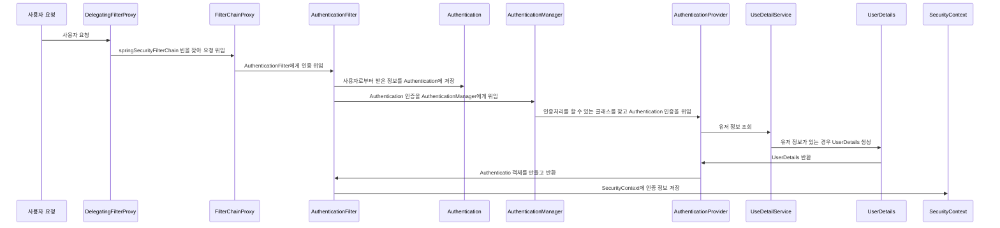

* 인가
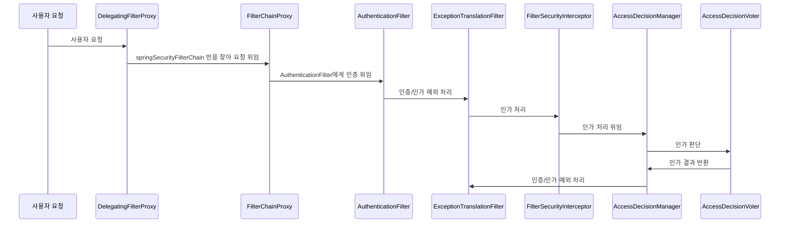

## Http Basic 인증
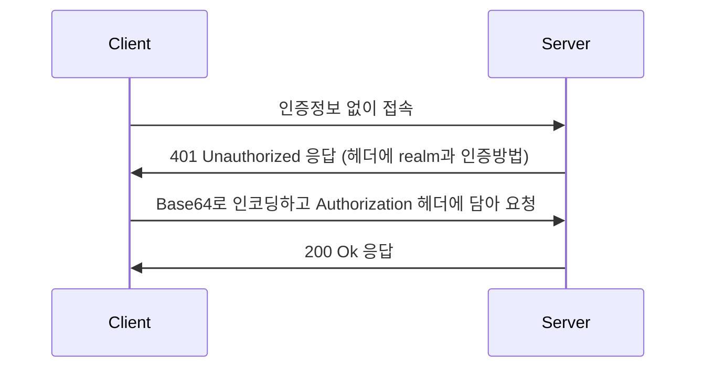
* base64 인코딩된 값은 쉽게 디코딩이 가능하기 때문에 인증정보가 노출된다.
* Http Basic 인증은 반드시 HTTPS와 같이 TLS 기술과 함께 사용해야 한다.

### HttpBasicConfigurer
* HttpBasic 인증에 대한 초기화를 진행하며 속성들에 대한 기본값들을 설정한다.
* 기본 AuthenticationEntryPoint는 BasicAuthenticationEntryPoint다.
* 필터는 BasicAuthenticationFilter를 사용한다.

### BasicAuthenticationFilter
* 이 필터는 기본 인증 서비스를 제공하는 데 사용된다.
* BasicAuthenticationConverter를 사용해서 요청 헤더에 기술된 인증정보의 유효성을 체크하며 Base64 인코딩된 username과 password를 추출한다.
* 인증이 성공하면 Authentication이 SecurityContext에 저장되고 인증이 실패하면 Basic 인증을 통해 다시 인증하라는 메시지를 표시하는 BasicAuthenticationEntryPoint가 호출된다.
* 인증 이후 세션을 사용하는 경우와 사용하지 않는 경우에 따라 처리되는 흐름에 차이가 있다. 세션을 사용하는 경우 매 요청 마다 인증과정을 거치지 않으나 세션을 사용하지 않는 경우 매 요청마다 인증과정을 거쳐야 한다.

### API
```java
protected void configure(final HttpSecurity http) throws Exception {
    http.authorizeRequests()
         .anyRequest().authenticated()
            .and()
            .httpBasic()
            .authenticationEntryPoint(new CustomAuthenticationEntryPoint());
}
```
## Cors 이해
Cross-Origin Resource Sharing, 교차 출처 리소스 공유
* HTTP 헤더를 사용하여, 한 출처에서 실행 중인 웹 애플리케이션이 다른 출처의 선택한 자원에 접근할 수 있는 권한을 부여하도록 브라우저에 알려주는 체제
* 웹 애플리케이션이 리소스가 자신의 출처와 다를 때 브라우저는 요청 헤더에 Origin 필드에 요청을 출처를 함께 담아 교차 출처 HTTP 요청을 실행한다.
* 출처를 비교하는 로직은 서버에 구현된 스펙이 아닌 브라우저에 구현된 스펙 기준으로 처리되며 브라우저는 클라이언트의 요청 헤더와 서버의 응답헤더를 비교해서 최종 응답을 결정한다.
* 두 개의 출처를 비교하는 방법은 URL의 구성요소중 Protocol, Host, Port 이 세가지가 동일한지 확인하면 되고 나머지는 틀려도 상관없다.

### Simple Request
* 예비 요청(Preflight) 과정없이 바로 서버에 본 요청을 한 후, 서버가 응답 헤더에 Access-Control-Allow-Origin과 같은 값을 전송하면 브라우저가 서로 비교후 CORS 정책 위반여부를 검사하는 방식
* 제약사항
  * GET, POST, HEAD 중의 한가지 Method를 사용해야 한다.
  * 헤더는 Accept, Accept-Language, Content-Language, Content-Type, DPR, Downlink, Save-Data, Viewport-Width width만 가능하고 Custom Header는 허용되지 않는다.
  * Content-type은 application/x-www-form-urlencoded, multipart/form-data, text/plain만 가능하다.

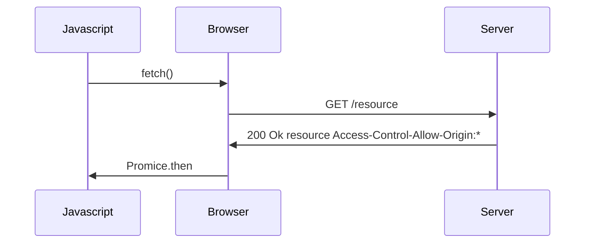

### Preflight Request
* 브라우저는 요청을 한번에 보내지 않고, 예비요청과 본요청으로 나누어 서버에 전달하는데 브라우저가 예비요청을 보내는 것을 Preflight라고 하고 OPTIONS 메소드가 사용된다.
* 예비요청의 역할은 본 요청을 보내기 전에 브라우저 스스로 안전한 요청인지 확인하는 것으로 요청 사앙이 SimpleRequest에 해당하지 않을 경우 브라우저가 Preflight Request를 실행한다.

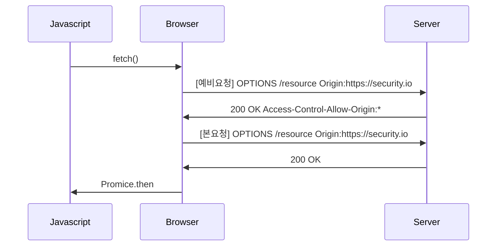

### 동일 출처 기준
scheme, host, port가 동일한 경우 동일 출처로 판단.

### CORS 해결 - 서버에서 Access-Control-Allow-* 세팅
* Access-Control-Allow-Origin - 헤더에 작성된 출처만 브라우저가 리소스에 접근할 수 있도록 허용한다.
* Access-Control-Allow-Methods - preflight request에 대한 응답으로 실제 요청 중에 사용할 수있는 메서드를 나타낸다.
  * 기본값은 GET, POST, HEAD, OPTIONS, *
* Access-Control-Allow-Headers - preflight request에 대한 응답으로 실제 요청 중에 사용할 수 있는 헤더 필드 이름을 나타낸다.
* Access-Control-Allow-Credentials - 실제 요청에 쿠키나 인증 등의 사용자 자격 증명이 포함될 수 있음을 나타낸다. Client의 credentials:include일 경우 true 필수
* Access-Control-Max-Age - preflight 요청 결과를 캐시 할 수 있는 시간을 나타내는 것으로 해당 시간동안은 preflight 요청을 다시 하지 않게 된다.

### CorsConfigurer
* Spring Security 필터 체인에 CorsFilter를 추가한다.
* corsFilter라는 이름의 bean이 제공되면 해당 CorsFilter가 사용된다.
* corsFilter라는 이름의 bean이 없고 CorsConfigurationSource 빈이 정의된 경우 해당 CorsConfiguration이 사용된다.
* CorsConfigurationSource 빈이 정의되어 있지 않은 경우 Spring MVC가 클래스 경로에 있으면 HandlerMappingIntrospector가 사용된다.

### CorsFilter
* Cors 예비 요청을 처리하고 Cors 단순 및 본 요청을 가로채고, 제공된 CorsConfigurationSource를 통해 일치된 정책에 따라 Cors 응답 헤더와 같은 응답을 업데이트하기 위한 필터이다.
* Spring MVC Java 구성과 Spring MVC XML 네임스페이스에서 Cors를 구성하는 대안이라 볼 수있다 (예: @CorsOrigin)
* 스프링 웹에 의존하는 응용 프로글매이나 java.servlet에서 Cors 검사를 수행해야 하는 보안 제약 조건에 유용한 필터이다.

### API

```java
import java.beans.BeanProperty;

@Override
protected void configure(final HttpSecurity http) throws Exception {
   http.authorizeRequests()
           .anyRequest().authenticated()
           .and();
   http.cors().configurationSource(corsConfigurationSource());
}

@Bean
public CorsConfigurationSource corsConfigurationSource() {
    CorsConfiguration configuration = new CorsConfiguration();
    configuration.addAllowedOrigin("*");
    configuration.addAllowedMethod("*");
    configuration.addAllowedHeader("*");
    configuration.setAllowCredintials(true);
    configuration.setMaxAge(3600L);
    
    UrlBasedCorsConfigurationSource source = new UrlBasedCorsConfigurationSource();
    source.registerCorsConfiguration("/**", configuration);
    return source;
}
```
# OAuth 2.0 용어 이해
## OAuth 2.0
* `O`pen + `Auth`orization
* OAuth 2.0 인가 프레임워크는 애플리케이션이 사용자 대신하여 사용자의 자원에 대한 제한된 액세스를 얻기 위해 승인 상호 작용을 함으로써 애플리케이션이 자체적으로 액세스 권한을 얻도록 한다.
* 즉 사용자가 속한 사이트의 보호된 자원에 대하여 애플리케이션의 접근을 허용하도록 승인하는 것을 의미한다.
* Delegated authorization framework - 위임 인가 프레임워크

## OAuth2 오픈소스 keyCloak 
### keycloak
* ID 및 접근 관리를 지원하는 인가서버 오픈 소스로 사용자 연합, 강력한 인증, 사용자 관리, 세분화된 권한 부여 등을 제공한다.

## OAuth 2.0 Roles 이해
OAuth 2.0 메커니즘은 다음 네가지 종류의 역할을 담당하는 주체들에 의해 이루어지는 권한 부여 체계이다.

1. Resource Owner(자원 소유자)
   * 보호된 자원에 대한 접근 권한을 부여할 수 있는 주체, 사용자로서 계정의 일부에 대한 접근 권한을 부여하는 사람
   * 사용자를 대신하여 작동하려는 모든 클라이언트는 먼저 사용자의 허가를 받아야 한다.

2. Resource Server(보호자원서버)
   * 타사 애플리케이션에서 접근하는 사용자의 자원이 포함된 서버를 의미한다.
   * 액세스 토큰을 수락 및 검증할 수 있어야 하며 권한 체계에 따라 요청을 승인할 수 있어야 한다.

3. Authorization Server(인가서버)
   * 클라이언트가 사용자 계정에 대한 동의 및 접근을 요청할 때 상호작용하는 서버로서 클라이언트의 권한 부여 요청을 승인하거나 거부하는 서버
   * 사용자가 클라이언트에게 권한 부여 요청을 승인한 후 access token을 클라이언트에게 부여하는 역할

4. Client(클라이언트)
   * 사용자를 대신하여 권한을 부여받아 사용자의 리소스에 접근하려는 애플리케이션
   * 사용자를 권한 부여 서버로 안내하거나 사용자의 상호 작용 없이 권한 부여 서버로부터 직접 권한을 얻을 수 있다.


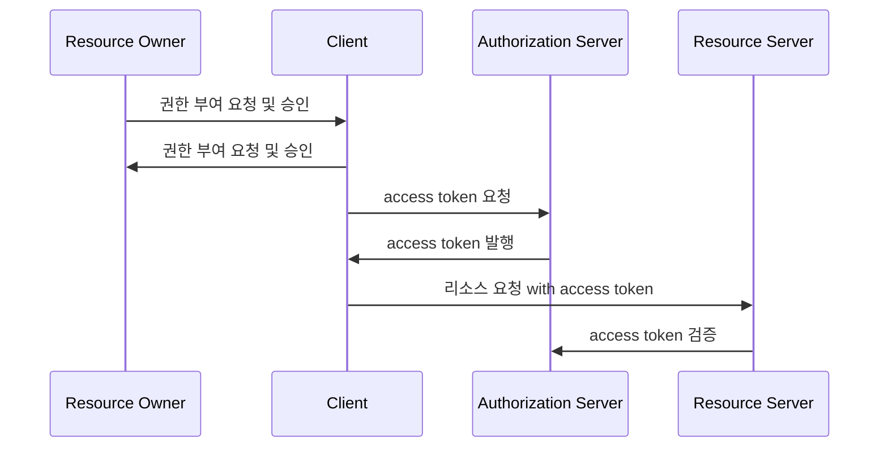

### OAuth 2.0 Client Types
* 개요
  * 인증 서버에서 클라이어트를 등록할 때 클라이언트 자격 증명인 클라이언트 아이디와 클라이언트 암호를 받는다.
  * 클라이언트 암호는 비밀이고 그대로 유지되어야 하는 반면 클라이언트 아이디는 공개이다.
  * 이 자격 증명은 인증서버에 대한 클라이언트 ID를 증명한다.

* 기밀 클라이언트 (Confidential Clients)
  * 기밀 클라이언트는 client_secret의 기밀성을 유지할 수 있는 클라이언트를 의미한다.
  * 일반적으로 사용자가 소스 코드에 액세스할 수 없는 서버에서 실행되는 응용 프로그램으로 .NET, Java, PHP 및 Node JS와 같은 서버 측 언어로 작성된다.
  * 이러한 유형의 애플리케이션은 대부분 웹 서버에서 실행되기 때문에 일반적으로 "웹앱" 이라고 한다.

* 공개 클라이언트 (Public Clients)
  * 공개 클라이언트는 client_secret의 기밀을 유지할 수 없으므로 이러한 앱에는 secret의 사용되지 않는다.
  * 브라우저에서 실행되는 Javascript 애플리케이션, Android, iOS 모바일 앱, 데스크톱에서 실행되는 응용프래그램 등이 있다.
  * 서버측이 아닌 리소스 소유자가 사용하는 장치에서 실행되는 모든 클라이언트는 공개클라이언트로 간주되어야 한다.

### Public
* front channel
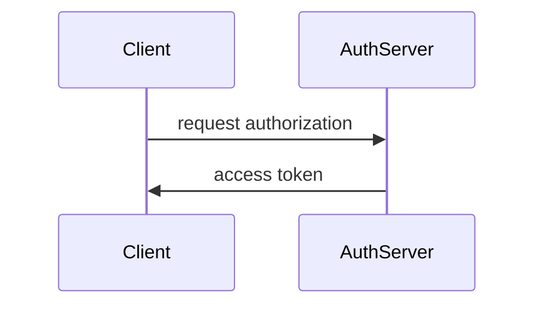
* back channel
```mermaid
sequenceDiagram
```

### Confidential
* front channel
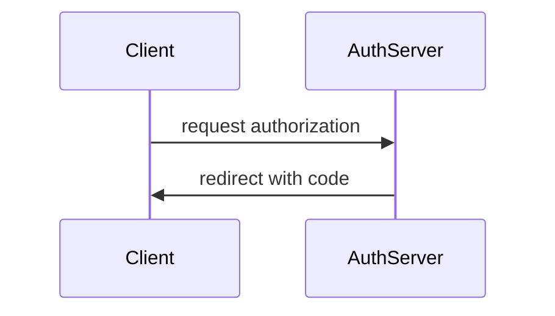
* back channel
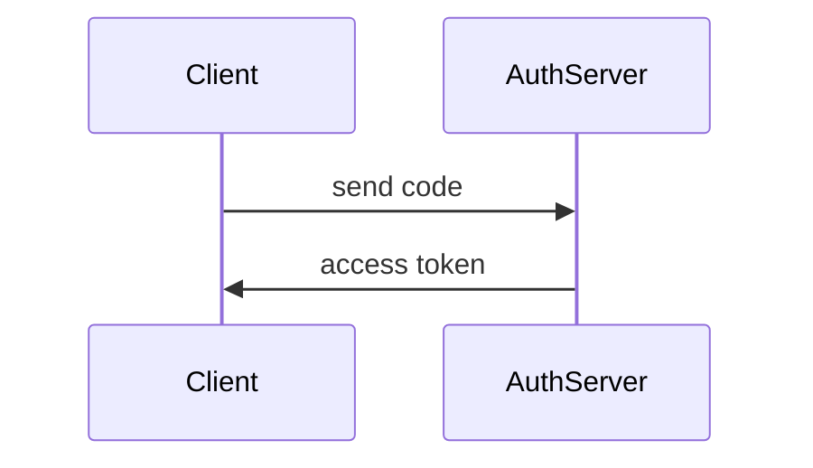

### OAuth 2.0 Token Types
1. Access Token
   * 클라이언트에서 사용자의 보호된 리소스에 접근하기 위해 사용하는 일종의 자격 증명으로서 역할을 하며 리소스 소유자가 클라이언트에게 부여한 권한 부여의 표현이다.
   * 일반적으로 JWT(Json Web Token) 형식을 취하지만 사양에 따라 그럴 필요는 없다.
   * 토큰에는 해당 액세스 기간, 범위 및 서버에 필요한 기타 정보가 있다.
   * 타입에는 식별자 타입 (Identifier Type)과 자체 포함타입 (Self-contained Type)이 있다.

2. Refresh Token
   * 액세스 토큰이 만료된 후 새 액세스 토큰을 얻기 위해 클라이언트 응용 프로그램에서 사용하는 자격 증명
   * 액세스 토큰이 만료되는 경우 클라이언트는 권한 부여 서버로 인증하고 Refresh Token을 전달한다.
   * 인증 서버는 Refresh Token의 유효성을 검사하고 새 액세스 토큰을 발급한다.
   * Refresh Token은 액세스 토큰과 달리 권한 서버 토큰 엔드포인트에만 보내지고 리소스 서버에는 보내지 않는다.

3. ID Token
4. Authorization Code
   * 권한 부여 코드 흐름에서 사용되며 이 코드는 클라이언트가 액세스 토큰과 교활할 임시 코드
   * 사용자가 클라이언트가 요청하는 정보를 확인하고 인가 서버로부터 리다이렉트 되어 받아온다.

### Access Token 유형
* 식별자 타입 (Identifier Type)
  * 인가 서버는 데이터 저장소에 토큰의 내용을 저장하고 이 토큰에 대한 고유 식별자만 클라이언트에 다시 발행한다.
  * 이 토큰을 수신하는 API는 토큰의 유효성을 검사하기 위해 인가서버에 대한 back channel 통신을 열고 DB를 조회해야 한다.

* 자체 포함 타입 (Self Contained Type)
  * JWT 토큰 형식으로 발급되며 클레임 및 만료가 있는 보호된 데이터 구조이다.
  * 리소스 서버 API가 검증 키 등의 핵심 자료에 대해 알게 되면 발급자와 통신할 필요 없이 자체 포함된 토큰의 유효성을 검사할 수 있다.
  * 특정한 암호화 알고리즘에 의해 개인키로 서명되고 공개키로 검증할 수 있으며 만료될 때까지 유효하다.

# OAuth 2.0 권한부여 유형
## OAuth 2.0 Grant Types 개요
### 권한 부여 유형
* 권한 부여란 클라이언트가 사용자를 대신해서 사용자의 승인하에 인가서버로부터 권한을 부여 받는 것을 의미한다.
* OAuth 2.0 메커니즘은 아래와 같은 권한 부여 유형들을 지원하고 있으며 일부는 Deprecated 되었다.

1. Authorization Code Grant Type
   * 권한 부여 타입, 서버 사이드 애플리케이션, 보안에 가장 안전한 유형
2. Implicit Grant Type (Deprecated)
   * 암시적 부여 타입, 공개 클라이언트 애플리케이션, 보안에 취약
3. Resource Owner Password Credentials Grant Type (Deprecated)
   * 리소스 사용자 비밀번호 자격증명 부여 타입, 서버 애플리케이션, 보안에 취약
4. Client Credentials Grant Type
   * 클라이언트 자격 증명 권한 부여 타입, UI or 화면이 없는 서버 애플리케이션
5. Refresh Token Grant Type
   * 새로고침 토큰 부여 타입, Authorization Code, Resource Owner Password Type에서 지원
6. PKCE-enhanced Authorization Code Grant Type
   * PKCE 권한 코드 부여 타입, 서버 사이드 애플리케이션, 공개 클라이언트 애플리케이션

* 권한 부여 흐름 선택 기준
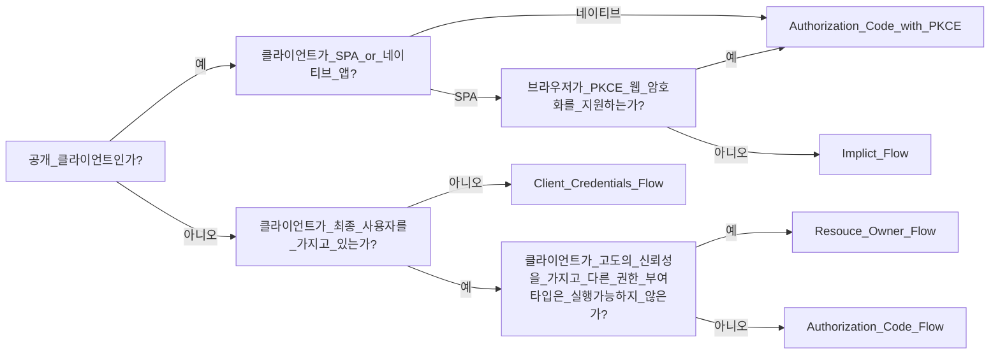

* 매개 변수 용어
1. client_id
   * 인가서버에 등록된 클라이언트에 대해 생성된 고유 키
2. client_secret
   * 인가서버에 등록된 특정 클라이언틔의 client_id에 대해 생성된 비밀 값
3. response_type
   * 애플리케이션이 권한 부여 코드 흐름을 시작하고 있음을 인증 서버에 알려준다.
   * code, token, id_token이 있으며 token, id_token은 implicit 권한부여유형에서 지원해야 한다.
   * 서버가 쿼리 문자열에 인증 코드(code), 토큰(token, id_token) 등 반환
4. grant_type
   * 권한 부여 타입 지정 - authorization_code, password, client_credentials, refresh_token
5. redirect_uri
   * 사용자가 응용 프로그램을 성공적으로 승인하면 권한 부여 서버가 사용자를 다시 응용 프로그램으로 리다이렉션 한다.
   * redirect_uri가 초기 권한 부여 요청에 포함된 경우 서비스는 토큰 요청에서도 이를 요구해야 한다.
   * 토큰 요청의 redirect_uri는 인증 코드를 생성할 때 사용된 redirect_uri와 정확히 일치해야 한다. 그렇지 않으면 서비스는 요청을 거부해야 한다.
6. scope
   * 애플리케이션이 사용자 데이터에 접근하는 것을 제한하기 위해 사용된다 
   * 사용자에 의해 특정 스코프로 제한된 권한 인가권을 발행함으로써 데이터 접근을 제한한다.
7. state
   * 응용 프로그램은 임의의 문자열을 생성하고 요청에 포함하고 사용자가 앱을 승인한 후 서버로부터 동일한 값이 반환되는지 확인해야 한다.
   * 이것은 CSRF 공격을 방지하는데 사용된다.

## Authorization Code Grant - 권한 부여 코드 승인 방식
### 개요
1. 흐름 및 특징
    1) 사용자가 애플리케이션을 승인하면 인가서버는 Redirect URI로 임시 코드를 담아서 애플리케이션으로 다시 리다이렉션 한다.
    2) 애플리케이션은 해당 코드를 인가 서버로 전달하고 액세스 토큰으로 교환한다.
    3) 애플리케이션이 액세스 토큰을 요청할 대 해당 요청을 클라이언트 암호로 인증할 수 있으므로 공격자가 인증 코드를 가로채서 스스로 사용할 위험이 줄어 든다.
    4) 액세스 토큰이 사용자 또는 브라우저에 표시되지 않고 애플리케이션에 다시 전달하는 가장 안전한 방법이므로 토큰이 다른 사람에게 누출될 위험이 줄어듬

2. 권한부여 요청 시 매개변수
    * response_type=code(필수)
    * client_id(필수)
    * redirect_uri(선택사항)
    * scope(선택사항)
    * state(선택사항)

3. 액세스 토큰 쿄환 요청 시 매개변수
    * grant_type=authorization_code(필수)
    * code(필수)
    * redirect_uri(필수: 리다이렉션 uri 초기 승인 요청에 포함된 경우)
    * client_id(필수)
    * client_secret(필수)

### 흐름
1. authorization code 요청: 인가서버에게 code를 요청한다.
2. 사용자 인증 & 동의하기: 사용자의 승인 및 동의하에 인가서버가 클라이언트에게 코드를 발급
3. Redirect 및 Access Token 교환 요청: 클라이언트의 권한부여가 승인되고 그 결과로 토큰을 획득

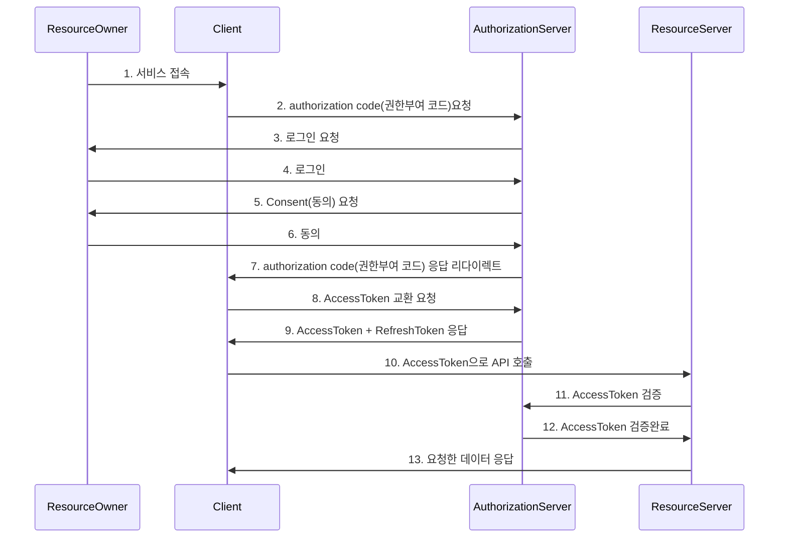

## Implicit Grant
### 개요
1. 흐름 및 특징
   * 클라이언트 javascript 및 Html 소스 코드를 다운로드한 후 브라우저는 서비스에 직접 API 요청을 한다.
   * 코드 교환 단계를 건너뛰고 대신 액세스 토큰이 쿼리 문자열 조각으로 클라이언트에 즉시 반환된다.
   * 이 유형은 back channel이 없으므로 refresh token을 사용하지 못한다.
   * 토큰 말료시 애플리케이션이 새로운 access token을 얻으려면 다시 OAuth 승인 과정을 거쳐야 한다.

2. 권한 부여 승인 요청시 매개변수
   * grant_type=token(필수), id_token
   * client_id(필수)
   * redirect_uri(필수: 리다이렉션 uri 초기 승인 요청에 포함된 경우)
   * scope(선택사항)
   * state(선택사항)

### 흐름
1. Access Token 요청

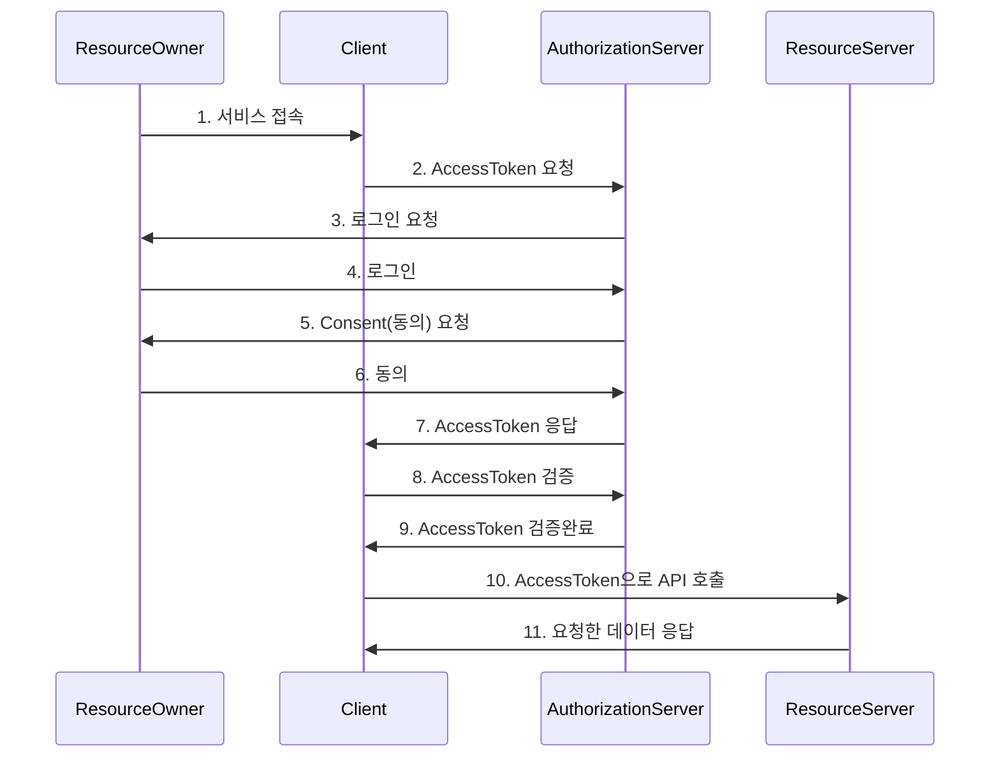

## Resource Owner Password Credentials Grant
### 개요
1. 흐름 및 특징
   * 애플리케이션이 사용자 이름과 암호를 액세스 토큰으로 교환할 때 사용된다.
   * 타사 애플리케이션이 이 권한을 사용하도록 허용해서는 안되고 고도의 신뢰할 자사 애플리케이션에서만 사용해야 한다.
   
2. 권한 부여 승인 요청 시 매개변수
   * grant_type=password(필수)
   * username(필수)
   * password(필수)
   * client_id(필수)
   * client_secret(필수)
   * scope(선택사항)

### 흐름
1. Access Token 요청
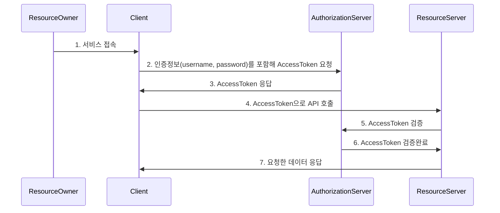

## Client Credentials Grant Type
### 개요
1. 흐름 및 특징
   * 애플리케이션이 리소스 소유자인 동시에 클라이언트의 역할을 한다.
   * 리소스 소유자에게 권한 위임을 받아 리소스에 접근하는 것이 아니라 자기 자신이 애플리케이션을 사용할 목적으로 사용하는 것
   * 서버 대 서버간의 통신에서 사용할 수 있으며 IOT와 같은 장비 애플리케이션과 통신을 위한 인증으로도 사용할 수 있다.
   * Client Id와 Client Secret을 통해 액세스 토큰을 바로 발급받을 수 있다.
   * Client 정보를 기반으로 하기 때문에 사용자 정보를 제공하지 않는다.
   
2. 권한 부여 승인 요청 시 매개변수
    * grant_type=client_credentials(필수)
    * client_id(필수)
    * client_secret(필수)
    * scope(선택사항)

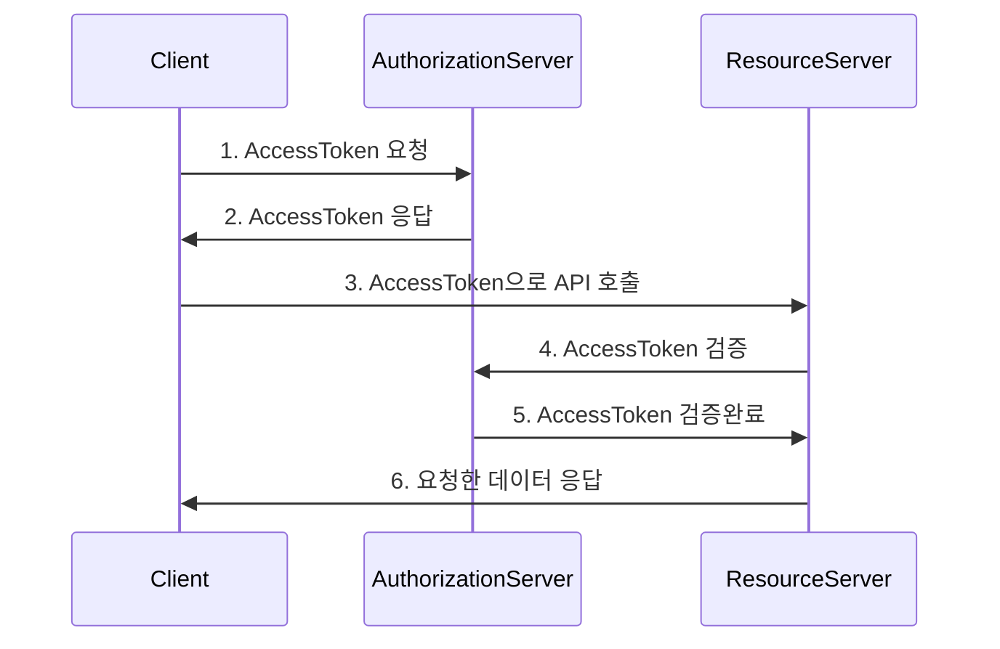

## Refresh Token Grant
### 개요
1. 흐름 및 특직
   * 액세스 토큰이 발급될 때 함께 제공되는 토큰으로 액세스 토큰이 만료되더라도 함께 발급받았던 리프레시 토큰이 유효하다면 인증 과정을 처음부터 반복하지 않고 액세스 토큰을 재발급 받을 수 있다.
   * 한 번 사용된 리프레시 토큰은 폐기되거나 재사용할 수 있다.

2. 권한 부여 승인 요청 시 매개변수
   * grant_type=refresh_token(필수)
   * refresh_token
   * client_id(필수)
   * client_secret(필수)

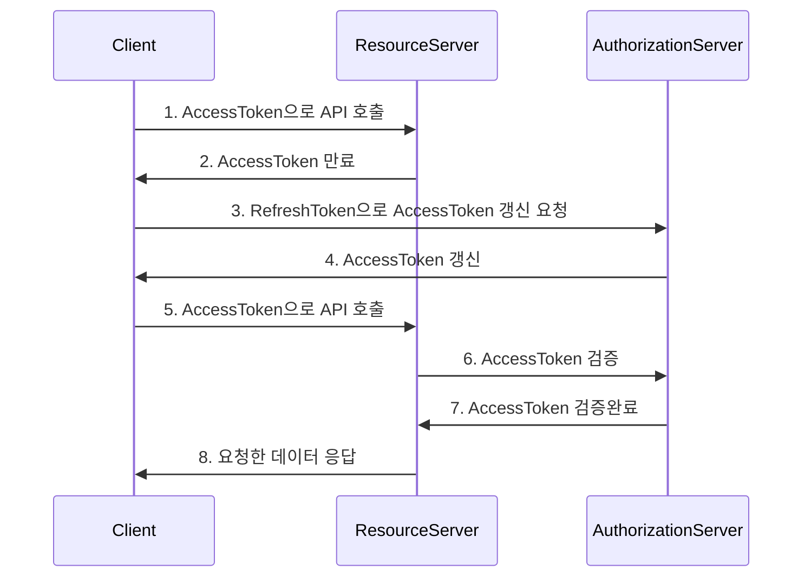

## PKCE-enhanced Authorization Code Grant Type
### PKCE(Proof Key for Code Exchange, RFC-6749) 개요
* 코드 교환을 위한 증명 키로서 CSRF 및 권한부여코드 삽입 공격을 방지하기 위한 Authorization Code Grant Flow의 확장버전이다.
* 권한부여코드 요청시 Code Verifier와 Code Challenge를 추가하여 만약 Authorization Code Grant Flow에서 Authorization Code가 탈취 당했을 때 AccessToken을 발급하지 못하도록 차단한다.
* PKCE는 모바일 앱에서 Authorization Code Grant Flow를 보호하도록 설계되었으며, 나중에 SPA에서도 사용하도록 권장되었으며 모든 OAuth2 클라이언트에서 유용하다.

### 코드 생성
1. Code Verifier
   1) 권한부여코드 요청 전에 애플리케이션이 원래 생성한 PKCE 요청에 대한 코드 검증기
   2) 48~128글자수를 가진 무작위 문자열
   3) A-Z, a-z, 0-9, -._~의 ASCII 문자들로만 구성됨
2. Code Challenge
   1) 선택한 Hash 알고리즘으로 Code Verifier를 Hashing 한 후 Base64 인코딩을 한 값
   2) ex) Base64Encode(Sha256(ASCII(Code Verifier)))
3. Code Challenge Method
   1) plain - Code Verifier가 특정 알고리즘을 사용하지 않도록 설정
   2) S256 - Code Verifier가 해시 알고리즘을 사용하도록 설정

### 처리 흐름
1. 단계
   1) 클라이언트는 code_verifier를 생성하고, code_challenge_method를 사용하요 code_challenge를 계산한다.
   2) 클라이언트가 /authorize에 대한 요청을 작성한다.
   3) 권한 서버가 /authorize에 대한 표준 OAutho2 요청 유효성 검증을 수행한다.
   4) 권한 서버가 code_challenge 및 code_challenge_method의 존재를 확인한다.
   5) 권한 서버가 권한 코드에 대해 code_challenge 및 code_challenge_method를 저장한다.
   6) 권한 서버가 권한 코드를 응답한다.
2. 단계
   7) 클라이언트가 code_verifier를 포함해 권한 코드를 /token에 제공한다.
   8) 권한 서버가 /token에 대한 표준 OAuth2 요청 유효성 검증을 수행한다.
   9) 권한 서버가 제공된 code_verifier 및 저장된 code_challenge_method를 사용하요 고유 code_challenge를 생성한다.
   10) 권한 서버가 생성된 code_challenge를 /authorize에 대한 초기 요청에 제공된 값과 비교한다.
   11) 두 값이 일치하면 액세스 토큰이 발행되고 일치하지 않으면 요청이 거부된다.

### code_challenge_method 검증
1. 권한 부요 코드 흐름에 있어 인가서버는 code_verifier를 검증하기 위해 code_challenge_method를 이미 알고 있어야 한다.
2. 토큰 교환시 code_challenge_method가 plain이면 인가서버는 전달된 code_verifier와 보관하고 있는 code_challenge 문자열과 단순히 일치하는지만 확인하면 된다.
3. code_challenge_method가 S256이면 인가서버는 전달된 code_verifier를 가져와 동일한 S256 메소드를 사용하여 변환한 다음 보관된 code_challenge 문자열과 비교해 일치 여부를 판단한다.

# OAuth 2.0 Open ID Connect
## 개요 및 특징
* OpenID Connect 1.0은 OAuth 2.0 프로토콜 위에 구축된 ID 계층으로 OAuth 2.0을 확장하여 인증 방식을 표준화한 OAuth 2.0 기반의 인증 프로토콜이다.
* scope 지정시 'openid'를 포함하면 OpenID Connect 사용이 가능하며 인증에 대한 정보는 ID 토큰(ID Token)이라고 하는 JWT 토큰으로 반환된다.
* OpenID Connect는 클라이언트가 사용자 ID를 확인할 수 있게 하는 보안 토큰인 ID Token을 제공한다.

## ID Token & Scope
### ID Token
* ID 토큰은 사용자가 인증 되었음을 증명하는 결과물로서 OIDC 요청시 access token과 함께 클라이언트에게 전달되는 토큰이다.
* ID 토큰은 JWT로 표현되며 헤더 페이로드 및 서명으로 구성된다.
* ID 토큰은 개인키로 발급자가 서명하는 것으로서 토큰의 출처를 보장하고 변조되지 않았음을 보장한다.
* 애플리케이션은 공개키로 ID 토큰을 검증 및 유효성을 검사하고 만료여부 등 토큰의 클레임을 확인한다.
* 클라이언트는 클레임 정보에 포함되어 있는 사용자명, 이메일을 활용하여 인증 관리를 할 수 있다.

### ID Token VS Access Token
* ID Token은 API 요청에 사용해서는 안되며 사용자의 신원을 확인하기 위해 사용되어져야 한다.
* Access Token은 인증을 위해 사용해서는 안되며 리소스에 접근하기 위해 사용되어져야 한다.

### OIDC Scope
* openid(필수) 클라이언트가 OpenID Connect 요청을 하고 있음을 인증 서버에 알린다.

request: 
```
GET http://[base-server-url]/oauth2/auth?
client_id=myClientApp
&response_type=id_token
&rediecturi=http://localhost:8080
&scope=openid profile email
*state=12345
&nonce=678910
```

### OIDC 로그인 요청
* OIDC 상호 작용 행위자
  1) OpenID Provider: 줄여서 OP라고하며 OpenID제공자로서 최종 사용자를 인증하고 인증 결과와 사용자에 대한 정보를 신뢰 당사자에게 제공할 수 있는 OAuth 2.0 서버를 의미한다.
  2) Relying Party: 줄여서 RP라고 하며 신뢰 당사자로서 인증 요청을 처리하기 위해 OP에 의존하는 OAuth 2.0 애플리케이션을 의미한다.
* 흐름
  1. RP는 OP에 권한 부여 요청을 보낸다.
  2. OP는 최종 사용자를 인증하고 권한을 얻는다.
  3. OP는 ID 토큰과 액세스 토큰을 응답한다.
  4. RP는 Access Token을 사용하여  userInfo 엔드포인트에 요청을 보낼 수 있다.
  5. userInfo 엔드포인트는 최종 사용자에 대한 클레임을 반환한다.

### OIDC 로그인 요청
* 매개변수 요청 및 응답
  * 요청시 openid 범위를 scope 매개변수에 포함해야 한다.
  * response_type 매개변수는 id_token을 포함한다.(response_type이 해당 토큰을 지원해야한다.)
  * 요청은 nonce 매개변수를 포함해야 한다.(Implicit Flow인 경우 필수)
    * 요청에 포함되는 값은 결과 id_token 값에 클레임으로 표함되며 이것은 토큰의 재생 공격을 방지하고 요청의 출처를 식별하는 데 사용할 수 있는 고유 문자열이다.
    * 해당 nonce 클레임에는 요청에 전송된 것과 정확히 동일한 값이 포함되어야 한다. 그렇지 않은 경우 애플리케이션에서 인증을 거부해야 한다.

# OAuth 2.0 Client
## 스프링 시큐리티와 OAuth 2.0

### Spring Security Oauth Project (Deprecated)
```
Client Support + Resource Server + Authorization Server
```
### Spring Security 5
```
Client Support + Resource Server 
```
Authorization Server를 별도로 

## OAuth 2.0 Client 소개
### 개요
* OAuth 2.0 인가 프레임워크의 역할 중 인가서버 및 리소스 서버와의 통신을 담당하는 클라이언트의 기능을 필터 기반으로 구현한 모듈
* 간단한 설정만으로 OAuth 2.0 인증 및 리소스 접근 권한, 인가서버 엔드포인트 통신등의 구현이 가능하며 커스터마이징, 확장이 용이하다.

* OAuth 2.0 Login
  * 애플리케이션의 사용자를 외부 OAuth 2.0 Provider나 OpenID Connect 1.0 Provider 계정으로 로그인할 수 있는 기능을 제공한다.
  * 클로벌 서비스 프로바이더인 구글, 깃허브 등 로그인을 OAuth 2.0 로그인을 구현할 수 있도록 지원한다.
  * OAuth 2.0 인가 프레임워크의 권한 부여 유형중 Authorization Code 방식을 사용한다.
* OAuth 2.0 Client
  * OAuth 2.0 인가 프레임워크에 정의된 클라이언트 역할을 지원한다.
  * 인가 서버의 권한 부여 유형에 따른 엔드포인트와 직접 통신할 수 있는 API를 제공한다.
    * Client Credentials
    * Resource Owner Password Credentials
    * Refresh Token
  * 리소스 서버의 보호자원 접근에 대한 연동 모듈을 구현할 수 있다.

# OAuth 2.0 Client Fundamentals
## application.yml / OAuth2ClientProperties
### 클라이언트 권한 부여 요청 시작
1. 클라이언트가 인가서버로 권한 부여 요청을 하거나 토큰 요청을 할 경우 클라이언트 정보 및 엔드포인트 정보를 참조해서 전달한다.
2. application.yml 환경설정 파일에 클라이언트 설정과 인가서버 엔드포인트 설정을 한다.
3. 초기화가 진행되면 application.yml에 있는 클라이언트 및 엔드포인트 정보가 OAuth2ClientProperties의 각 속성에 바인딩 된다.
4. OAuth2ClientProperties에 바인딩 되어있는 속성의 값은 인가서버로 권한부여 요청을 하귀 위한 Client Registration 클래스의 필드에 저장된다.
5. OAuth2Client는 ClientRegistration를 참조해서 권한부여 요청을 위한 매개변수를 구성하고 인가서버와 통신한다.

### application.yml
```yml
spring:
  security:
    oauth2:
      client:
        registration:
          keycloak:
            authorization-grant-type: authorization_code  # OAuth2.0 권한 부여 타입
            client-id: oauth2-client-app  # 서비스 공급자에 등록된 클라이언트 아이디
            client-name: oauth2-client-app # 클라이언트 이름
            client-secret: KkIpKeQmJEj6wGXIhCZ0b95wY1Z0oHD1 # 서비스 공급자에 등록된 클라이언트 비밀번호
            redirect-uri: http://localhost:8081/login/oauth2/codekeycloak # 인가서버에서 권한 코드 부여후 클라이언트로 리다이렉트 하는 위치
            client-authentication-method: client_secret_post  # 클라이언트 자격증명 전송방식
            scope: openid,email # 리소스 접근 제한 범위
        provider:
          keycloak:
            authorization-uri: http://localhost:8080/realms/oauth2/protocol/openid-connect/auth # OAuth2.0 권한 코드 부여 엔드포인트
            issuer-uri: http://localhost:8080/realms/oauth2 # 서비스 공급자 위치
            jwk-set-uri: http://localhost:8080/realms/oauth2/protocol/openid-connect/certs # OAuth2.0 JwKSetUri 엔드포인트
            token-uri: http://localhost:8080/realms/oauth2/protocol/openid-connect/token # OAuth2.0 토큰 엔드포인트
            user-info-uri: http://localhost:8080/realms/oauth2/protocol/openid-connect/userinfo # OAuth2.0 userInfo 엔드포인트
            user-name-attribute: preferred_username # OAuth2.0 사용자명을 추출하는 클레임명
```

### OAuth2ClientProperties(prefix ="spring.security.oauth2.client")
* Registration은 인가 서버에 등록된 클라이언트 및 요청 파라미터 정보를 나타낸다.
* Provider는 공급자에서 제공하는 엔드포인트 등의 정보를 나타낸다.
* 클라이언트 및 공급자의 정보를 registration /provider 맵에 저장하고 인가서버와의 통신 시 각 항목을 참조하여 사용한다.

## ClientRegistration
### 개념
* OAuth 2.0 또는 OpenID connect 1.0 Provider에서 클라이언트의 등록 정보를 나타낸다.
* ClientRegistration은 OpenID Connect Provider의 설정 엔드포인트나 인가 서버의 메타데이터 엔드포인트를 찾아 초기화할 수 있다.
* ClientRegistration의 메소드를 사용하면 편리하게 ClientRegistration을 설정할 수 있다.
  * `ClientRegistration clientRegistration = ClientRegistration.fromIssuerLocation("https://idp.example.com/issuer").build();`

#### ClientRegistration
* registrationId: clientRegistration을 식별할 수 있는 유니크한 ID
* clientId: 클라이언트 식별자
* clientSecret: 클라이언트 secret
* clientAuthenticationMethod: provider에서 클라이언트를 인증할 때 사용할 메소드로서 basic, port, none(public 클라이언트)을 지원한다.
  * authorizationGrantType: OAuth 2.0 인가 프레임워크는 네가지 권한을 부여 타입을 정의하고 있으며 지원하는 값은 `authorization_code`, `implicit`, `client_credentials`, `password`다.
* redirectUriTemplate: 클라이언트에 등록한 리아딩렉트 URL로, 사용자의 인증으로 클라이언트에 접근 권한을 부여하고 나면, 인가 서버가 이 URL로 최종 사용자의 브라우저를 리다이렉트 시킨다.
* scopes: 인가 요청 플로우에서 클라이언트가 요청한 openid, 이메일, 프로필 등의 scope
* clientName: 클라이언트를 나타내는 이름으로 자동 생성되는 로그인 페이지에서 노출하는 등에 사용한다.
* tokenUri: 인가 서버의 토큰 엔드포인트 URL
* jwkSetUri: 인가 서버에서 Json Web Key Set을 가져올 때 사용할 URI. 이 keySet에는 ID 토큰의 Json Web Signature를 검증할 때 사용할 암호키가 있으며, UserInfo 응답을 검증할 때 사용할 수 있다.
* configurationMetadata: OpenID Provider 설정 정보로서 application.properties에 spring.securityoauth2.client.provider를 설정했을 때만 사용할 수 있다.
* uri: 인증된 최종 사용자의 클레임/속성에 접근할 때 사용하는 uri
* authenticationMethod: 엔드포인트로 액세스 토큰을 전송할 때 사용할 인증 메소드. header, form, query를 지원한다.
* userNameAttributeName: userInfo 응답에 있는 속성 이름으로, 최종 사용자의 이름이나 식별자에 접근할 때 사용한다.

### CommonOAuth2Provider
* OAuth 2.0 공급자 정보를 제공하는 클래스로서 글로벌 서비스 제공자 일부는 기본으로 제공되어진다.
* Client ID와 Client Secret은 별도로 application.properties에 작성해야 한다.
* 국내 공급자 정보는 수동으로 작성해서 사용해야 한다.
* 클라이언트 기준인 Registration 항목과 서비스 제공자 기준인 Provider 항목으로 구분하여 설정한다.
* application.properties가 아닌 Java Config 방식으로 ClientRegistration 등록을 설정할 수 있다.
* clientRegistration 객체를 생성할 수 있는 빌더 클래스를 반환한다.

## ClientRegistrationRepository 이해 및 활용
### 개념
* ClientRegistrationRepository는 OAuth 2.0 & OpenId Connect 1.0의 ClientRegistration 저장소 역할을 한다.
* 클라이언트 등록 정보는 궁극적으로 인가 서버가 저장하고 관리하는데 이 레포지토리는 인가 서버에 일차적으로 저장된 클라이언트 등록 정보의 일부 검색하는 기능을 제공한다.
* 스프링 부트 2.x 자동 설정은 spring.security.oauth2.client.registration.[registrationId] 하위 프로퍼티를 ClientRegistration 인스턴스에 바인딩하며, 각 ClientRegistration 객체를 ClientRegistrationRepository의 안에 구성한다.
* ClientRegistrationRepository의 디폴트 구현체는 InMemoryClientRegistrationRepositoryek.
* 자동 설정을 사용하면 ClientRegistrationRepository도 ApplicationContext 내 @Bean으로 등록하므로 필요하다면 원하는 곳에 의존성을 주입할 수 있다.

## 자동설정에 의한 초기화 과정 이해
1. OAuth2ImportSelector
2. OAuth2ClientConfiguration
3. OAuth2ClientWebMvcImportSelector
4. OAuth2ClientWebMvcSecurityConfiguration
   * DefaultOAuth2AuthorizedClientManager
   * HandlerMethodArgumentResolver

1. OAuth2ClientAutoConfiguration
   * OAuth2ClientRegistrationRepositoryConfiguration
     * InMemoryClientRegistrationRepository
   * OAuth2ClientWebSecurityConfiguration
     * ImMemoryOAuth2AuthorizedClientService
     * AuthenticatedPrincipalOAuth2AuthorizedClientRepository
     * oauth2SecurityFilterChain

# OAuth 2.0 Client - oauth2Login()
## OAuth2LoginConfigurer 초기화 이해
* init
  * OAuth2LoginAuthenticationFilter
  * OAuth2LoginAuthenticationProvider
  * OidcAuthorizationCodeAuthenticationProvider
  * DefaultLoginPageGeneratingFilter

1. configure
2. OAuth2AuthorizationRequestRedirectFilter

## OAuth2 로그인 구현 - OAuth 2.0 Login Page 생성
* OAuth 2.0 로그인 페이지 자동 생성
  * 기본적으로 OAuth 2.0 로그인 페이지 DefaultLoginPageGeneratingFilter가 자동으로 생성해 준다.
  * 이 디폴트 로그인 페이지는 OAuth 2.0 클라이언트 명을 보여준다.
  * 링크를 누르면 인가 요청을 시작할 수 있다.
* 요청 매핑 Url
  * RequestMatcher : /oauth2/authorization/{registrationId}*
  * 디폴트 로그인 페이지를 재정의하려면 `oauth2Login().loginPage()`를 사요하면 된다.

## OAuth2 로그인 구현 - Authorization Code 요청하기
### 개요
* 주요 클래스
  * OAuth2AuthorizationRequestRedirectFilter
    * 클라이언트는 사용자의 브라우저를 통해 인가 서버의 권한 부여 엔드포인트로 리다이렉션하여 권한 코드 부여 흐름을 시작한다.
    * 요청 매핑 url
      * AuthorizationRequestMatcher: /oauth2/authorization/{registrationId}*
      * AuthorizationEndpointConfig. authorizationRequestBaseUri를 통해 재정의될 수 있다.
  * DefaultOAuth2AuthorizationRequestResolver
    * 웹 요청에 대하여 OAuth2AuthorizationRequest 객체를 최종 완성한다.
    * /oauth2/authorization/{registrationId}와 일치하는지 확인해서 일치하면 registrationId를 추출하고 이를 사용해 ClientRegistration을 가져와 OAUth2AuthorizationRequest를 빌드한다.
  * OAuth2AuthorizationRequest
    * 토큰 엔드포인트 요청 파라미터를 담은 객체로서 인가 응답을 연계하고 검증할 때 사용한다.
  * OAuth2AuthorizationRequestRepository
    * 인가 요청을 시작한 시점부터 인가 요청을 받는 시점까지 OAuth2AuthorizationRequest를 유지해준다.

## OAuth2 로그인 구현 - Access Token 교환하기
### 개요
* 주요 클래스
  * OAuth2LoginAuthenticationFilter
    * 인가서버로부터 리다이렉트 되면서 전달된 code를 인가 서버의 Access Token으로 교환하고 Access Token이 저장된 OAuth2LoginAuthenticationToken을 AuthenticationManager에 위임하여 UserInfo 정보를 요청해서 최종 사용자에 로그인 한다.
    * OAuth2AuthorizedClientRepository를 사용하여 OAuth2AuthorizedClient를 저장한다.
    * 인증에 성공하면 OAuth2AuthorizedClientRepository를 사용하여 OAuthorizedClient를 저장한다.
    * 인증에 성공하면 OAuth2AuthenticationToken이 생성되고 SecurityContext에 저장되어 인증처리를 완료한다.
    * 요청 매핑 url
      * RequestMatcher: /login/oauth2/code/*
  * OAuth2LoginAuthenticationProvider
    * 인가 서버로부터 리다이렉트 된 이후 프로세스를 처리하며 Access Token으로 교환하고 이 토큰을 사용하여 UserInfo 처리를 담당한다.
    * scope에 openid가 포함되어있으면 OidcAuthorizationCodeAuthenticationProvider를 호출하고 아니면 OAuth2AuthorizationCodeAuthenticationProvider를 호출하도록 제어한다.
  * OAuth2AuthorizationCodeAuthenticationProvider
    * 권한 코드 부여 흐름을 처리하는 AuthenticationProvider
    * 인가 서버에 Authorization Code와 Access Token의 교환을 담당하는 클래스
  * OidcAuthorizationCodeAuthenticationProvider
    * OpenID Connect core 1.0 권한 코드 부여 흐름을 처리하는 AuthenticationProvider이며 요청 scope에 openid가 존재할 경우 실행된다.
  * DefaultAuthorizationCodeTokenResponseClient
    * 인가 서버의 token 엔드포인트로 통신을 담당하며 Access Token을 받은후 OAuth2AccessTokenResponse에 저장하고 반환한다.

## OAuth2 로그인 구현 - OAuth 2.0 User 모델 소개
### 개요
* OAuth2UserService
  * 액세스 토큰을 사용해 UserInfo 엔드포인트 요청으로, 최종 사용자의 속성을 가져오며 OAuth2User 타입의 객체를 리턴한다.
  * 구현체로 DefaultOAuth2UserService와 OidcUserService가 제공된다.
  
* DefaultOAuth2UserService
  * 표준 OAuth 2.0 Provider를 지원하는 OAuth2UserService 구현체다.
  * OAuth2UserRequest에 AccessToken을 담아 인가서버와 통신 후 사용자의 속성을 가지고 온다.
  * 최종 OAuth2User 타입의 객체를 반환한다.
* OidcUserService
  * OpenID Connect 1.0 Provider를 지원하는 OAuth2UserService 구현체다
  * OidcUserRequest에 있는 ID Token을 통해 인증 처리를 하며 필요시 DefaultOAuth2UserService를 사용해 UserInfo 엔드포인트의 사용자 속성을 요청한다.
  * 최종 OidcUser 타입의 객체를 반환한다.

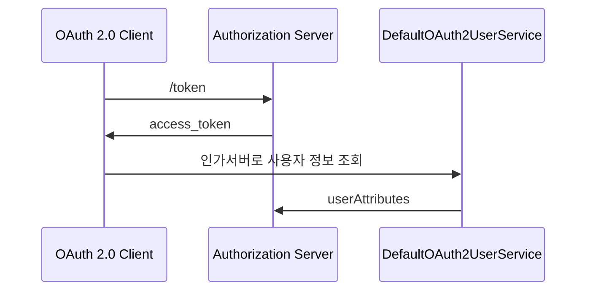
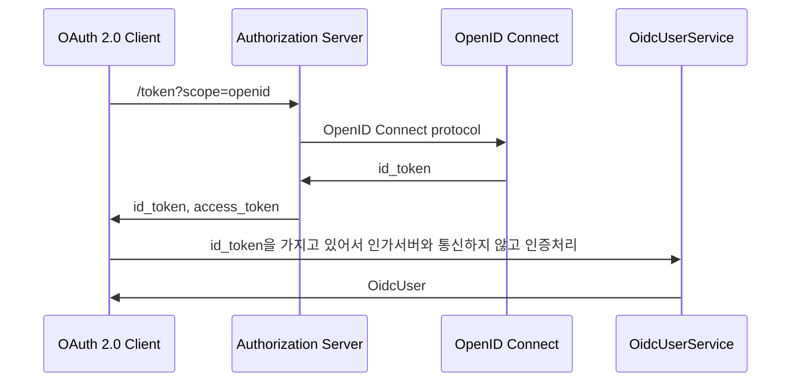
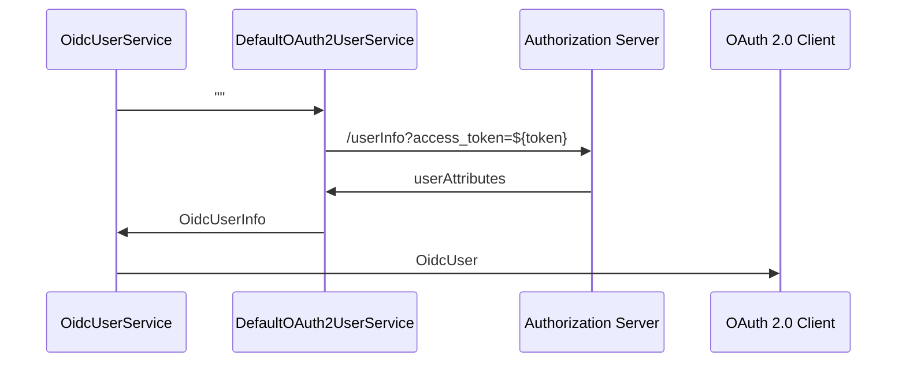

## 구조
* DefaultOAuth2UserService는 OAuth2User 타입의 객체를 반환한다.
* OidcUserService는 OidcUser 타입의 객체를 반환한다.
* OidcUserRequest의 승인된 토큰에 포함되어 있는 scope 값이 accessibleScopes의 값 들중 하나 이상 포함되어 있을 경우 UserInfo 엔드 포인트를 요청한다.

## OAuth2User & OidcUser
### 개요
* 시큐리티는 UserAttributes 및 ID Token Claims을 집계 & 구성하여 OAuth2와 OidcUser 타입의 클래스를 제공한다.
* OAuth2User
  * OAuth 2.0 Provider에 연결된 사용자 주체를 나타낸다.
  * 최종 사용자의 인증에 대한 정보인 Attributes를 포함하고 있으며 first name, middle name, last name, email, phone number, address 등으로 구성된다.
  * 기본 구현체는 DefaultOAuth2User이며 인증 이후 Authentication의 principal 속성에 저장된다.
* OidcUser
  * OAuth2User를 상송한 인터페이스이며 OIDC Provider에 연결된 사용자 주체를 나타낸다.
  * 최종 사용자의 인증에 대한 정보인 Claims를 포함하고 있으며 OidcIdToken 및 OidcUserInfo에서 집계 및 구성된다.
  * 기본 구현체는 DefaultOidcUser이며 DefaultOAuth2User를 상송하고 있으며 인증 이후 Authentication의 principal 속성에 저장된다.

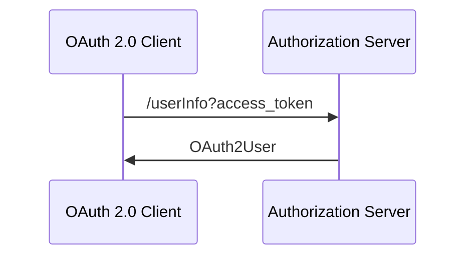
```mermaid
sequenceDiagram
    OAuth 2.0 Client ->> Authorization Server: /token?scope=openid
    Authorization Server ->> OpenID Connect: claims, id_token 요청
    OpenID Connect ->> OAuth 2.0 Client: claims, id_token
```

## OAuth2 로그인 구현 - UserInfo 엔드포인트 요청하기
* OAuth 2.0 Provider UserInfo 엔드포인트 요청하기
### 개요
* 주요 클래스 
  * DefaultOAuth2UserService
    * `public OAuth2User loadUser(OAuth2UserReqeust userRequest)
  * OAuth2UserRequestEntityConverter`
    * OAuth2UserReqeust를 ResponseEntity로 컨버터 한다.
  * RestOperations

* OpenID Connect Provider OidcUserInfo 엔드포인트
* 주요 클래스
  * OidcUserService
    * `public OidcUser loadUser(OidcUserRequest userReqeust)`
    * 내부에 DefaultOAuth2UserService를 가지고 있으며 OIDC 사양에 부합할 경우 OidcUserReqeust를 넘겨주어 인가서버와 통신한다.
    * OidcUser 타입의 객체를 반환한다.

## OAuth2 로그인 구현 - OpenID Connect 로그아웃
* 개념
  * 클라이언트는 로그아웃 엔드포인트를 사용하여 웹 브라우저에 대한 세션과 쿠키를 지운다.
  * 클라이언트 로그아웃 성공 후 OidcClientInitiatedLogoutSuccessHandler를 호출하여 OpenID Proivder 세션 로그아웃 요청한다.
  * OpenID Provider 로그아웃 성공하면 지정된 위치로 리다이렉트 한다.
  * 인가 서버 메타데이터 사양에 있는 로그아웃 엔드포인트는 end_session_endpoint로 정의되어있다.
  
* API 설정
```java
http.logout()
    .logoutSuccessHandler(oidcLogoutSuccessHandler())
    .invalidateHttpSession(true)
    .clearAuthentication(true)
    .deleteCookies("JSESSIONID")
```
```java
private OidcClientInitiatedLogoutSuccessHandler oidcLogoutHandler() {
    OidcClientInitiatedLogoutSuccessHandler successHandler = new OidcClientInitiatedLogoutSuccessHandler(clientRegistrationRepository);
    successHandler.setPostLogoutRedirectUri("http://localhost:8081/login");
    return successHandler;
}
```

## OAuth2 로그인 구현 - Spring MVC 인증 객체 참조하기
* Authentication
  * `public void dashboard(Authentication authentication) {}`
    * oauth2Login()으로 인증을 받게 되면 Authentication은 OAuth2AuthenticationToken 타입의 객체로 바인딩 된다.
    * principal에는 OAuth2User 타입 혹은 OidcUser 타입의 구현체가 저장된다.
    * DefaultOidcUser는 OpenID Connect 인증을 통해 ID Token 및 클레임 정보가 포함된 객체이다.
* @AuthenticationPrincipal
  * `public void dashboard(@AuthenticationPrincipal Oauth2User principal or OidcUser principal) {}`
  * AuthenticationPrincipalArgumentResolver 클래스에서 요청을 가로채어 바인딩 처리를 한다.
    * Authentication을 SecurityContext로부터 꺼내와서 Principal 속성에 OAuth2User 혹은 OidcUser 타입의 객체를 저장한다.


## API 커스텀 구현 -Authorization BaseUrl & Redirection BaseUrl
```java
http.oauth2Login(oauth2 -> oauth2
        .loginPage("/login")
        .loginProcessingUrl("/login/v1/oauth2/code/")
        .authorizationEndpoint(authorizationEndpointConfig -> authorizationEndpointConfig.baseUri("/oauth2/v1/authorization"))
        .redirectionEndpoint(redirectionEndpointConfig -> redirectionEndpointConfig.baseUri("/login/v1/oauth2/code/*"))
)
```
* authorizationEndpoint.baseUri("/ouaht2/v1/authorization")은 권한 부여 요청 BaseUri를 커스텀한다.
  * 1단계 권한 부여 요청을 처리하는 OAuth2AuthorizationRequestRedirectFilter에서 요청에 대한 매칭 여부를 판단한다.
  * 설정에서 변경한 값이 클라이언트의 링크 정보와 일치하도록 맞추어야 한다.
* redirectionEndpoint.baseUri("/login/v1/oauth2/code/*)는 인가 응답의 baseUri를 커스텀한다.
  * Token 요청을 처리하는 OAuth2LoginAuthenticationFilter에서 요청애 대한 매칭 여부를 판단한다.
    * application.yml 설정 파일에서 registration 속성의 redirectUri 설정에도 변경된 값을 적용해야 한다.
    * 인가 서버의 redirectUri 설정에도 변경된 값을 적용해야 한다.
  * loginProcessUrl("/login/v1/oauth2/code/*)를 설정해도 결과는 동일하지만 redirectionEndpoint.baseUri가 더 우선이다.

## API 커스텀 구현 - OAuth2AuthorizationRequestResolver
### OAuth2AuthorizationRequestResolver
* Authorization Code Grant 방식에서 클라이언트 인가서버로 권한 부여 요청을 할 때 실행되는 클래스
* OAuth2AuthorizationRequestResolver는 OAuth 2.0 인가 프레임워크에 정의된 표준 파라미터 외에 다른 파라미터를 추가하는 식으로 인가 요청을 할 때 사용한다.
* DefaultOAuth2AuthorizationRequsetResolver가 디폴트 구현체로 제공되며 Consumer<OAuth2AuthorizationRequest.Builder> 속성에 커스텀할 내용을 구현한다.

# OAuth 2.0 Client - oauth2Client()
## OAuth2AuthorizedClient
### 개념
* OAuth2AuthorizedClient는 인가받은 클라이언트를 의미하는 클래스다.
* 최종 사용자(리소스 소유자)가 클라이언트에게 리소스에 접근할 수 있는 권한을 부여하면, 클라이언트를 인가된 클라이언트로 간주한다.
* OAuth2AuthorizedClient는 AccessToken과 RefreshToken을 ClientRegistration(클라이언트)와 권한을 부여한 최종 사용자인 Principal과 함께 묶어 준다.
* OAuth2AuthorizedClient의 AccessToken을 사용해 리소스 서버의 자원에 접근 할 수 있으며 인가 서버와의 통신으로 토큰을 검증할 수 있다.
* OAuth2AuthorizedClient의 ClientRegistration과 AccessToken을 사용해서 UserInfo 엔드포인트로 요청할 수 있다.

### OAuth2AuthorizedClientRepository
* OAuth2AuthorizedClientRepository는 다른 웹 요청이 와도 동일한 OAuthorizedClient를 유지하는 역할을 담당한다.
* OAuth2AuthorizedClientService에게 OAuth2AuthorizedClient의 저장, 조회, 삭제 처리를 위임한다.

### OAuth2AuthorizedClientService
* OAuth2AuthorizedClientService는 애플리케이션 레벨에서 OAuth2AuthorizedClient를 관리(저장, 조회, 삭제)한다.

### 웹 애플리케이션에서 활용
* OAuth2AuthorizedClientRepository나 OAuth2AuthorizedClientService는 OAuth2AuthorizedClient에서 OAuth2AccessToken을 찾을 수 있는 기능을 제공하므로 보호중인 리소스 요청을 시작할 때 사용할 수 있다.

## OAuth2AuthorizationCodeGrantFilter
### 개념
* AuthorizationCodeGrant 방식으로 권한 부여 요청을 지원하는 필터
* 인가 서버로부터 리다이렉트 되면 전달된 code를 인가 서버의 AccessToken으로 교환한다.
* OAuth2AuthorizedClientRepository를 사용하여 OAuth2AuthorizedClient를 저장후 클라이언트의 RedirectUri로 이동한다.

### 실행 조건
* 요청 파라미터에 code와 state 값이 존재하는지 확인
* OAuth2AuthorizationRequest 객체가 존재하는 지 확인

## DefaultOAuth2AuthorizedClientManager
### 개념
* OAuth2AuthorizedClinet를 전반적으로 관리하는 인터페이스
* OAuth2AuthorizedClientProvider로 OAuth 2.0 클라이언트에 권한 부여
  * Client Credentials Flow
  * Resource Owner Password Flow
  * Refresh Token Flow
* OAuth2AuthorizedClientService나 OAuth2AuthorizedClientRepository에 OAuth2AuthrizedClient 저장을 위임한 후 OAuth2AuthorizedClient 최종 반환
* 사용자 정의 OAuth2AuthorizationSuccessHandler 및 OAuth2AuthorizationFailureHandler를 구성하여 성공/실패 처리를 변경할 수 있다.
* invalid_grant 오류로 인해 권한 부여 시도가 실패하면 이전에 저장된 OAuth2AuthorizedClient가 OAuth2AuthorizedClientRepository에서 제거 된다.

### 특징
* clientRegistrationRepository: 인가 서버가 저장하고 소유하고 있는 클라이언트 등록 정보의 복사본을 저장한다.
* OAuth2AuthorizedClientRepository: 클라이언트와 인가 서버 요청 간에 OAuth2AuthorizedClient 정보를 계속 유지하며 OAuth2AuthorizedClientService에게 위임하여 처리한다.
* OAuth2AuthorizedClient의 저장, 조회, 삭제 과리를 담당한다.

* OAuth 2.0 클라이언트 인증(또는 재인증) 하기 위한 전략 클래스로 특정 권한 부여 유형을 구현한다.
  * ClientCredentialsOAuth2AuthorizedClientProvider
  * PasswordOAuth2AuthorizedClientProvider
  * RefreshTokenOAuthorizedClientProvider

* 인가 서버의 토큰 엔드포인트에서 액세스 토큰 저장 증명에 대한 인증 코드를 "교환" 하기 위한 전략
  * DefaultClientCredentialsTokenResponseClient
  * DefaultPasswordTokenResponseClient
  * DefaultRefreshTokenResponseClient

### 생성
```java
@Bean
public OAuth2AuthorizedClientManager authorizedClientManager(ClientRegistrationRepository clientRegistrationRepository, OAuth2AuthorizedClientRepository authorizedClientRepository) {
    OAuth2AuthorizedClientProvider auth2AuthorizedClientProvider = OAuth2AuthorizedClientProviderBuilder.builder()
            .authorizationCode()
            .refreshToken()
            .clientCredentials()
            .password()
            .build();

    DefaultOAuth2AuthorizedClientManager authorizedClientManager = new DefaultOAuth2AuthorizedClientManager(clientRegistrationRepository, authorizedClientRepository);
    authorizedClientManager.setAuthorizedClientProvider(auth2AuthorizedClientProvider);
    return authorizedClientManager;
}
```
## DefaultOAuth2AuthorizedClientManager
### 개요
* 스프링 시큐리티의 OAuth2Login 필터에 의한 자동 인증 처리를 하지 않고 DefaultOAuth2AuthorizedClientManager 클래스를 사용하여 Spring MVC에서 직접 인증 처리를 하는 로그인 기능을 구현한다.
```java
@Bean
public OAuth2AuthorizedClientManager authorizedClientManager(ClientRegistrationRepository clientRegistrationRepository, OAuth2AuthorizedClientRepository authorizedClientRepository) {
    OAuth2AuthorizedClientProvider authorizedClientProvider = OAuth2AuthorizedClientProviderBuilder.builder()
            .authorizationCode()
            .password()
            .clientCredentials()
            .refreshToken()
            .build();

    DefaultOAuth2AuthorizedClientManager authorizedClientManager = new DefaultOAuth2AuthorizedClientManager(clientRegistrationRepository, authorizedClientRepository);
    authorizedClientManager.setAuthorizedClientProvider(authorizedClientProvider);
    return authorizedClientManager;
}
```

### 기본 구성
* AppConfig - DefaultOAuth2AuthorizedClientManager 빈 생성 및 설정 초기화
* DefaultOAuth2AuthorizedClientManager - OAuth2 권한 부여 흐름을 처리
* LoginController - DefaultOAuth2AuthorizedClientManager를 사용해서 로그인 처리
* home.html - 인증 받은 사용자만 접근 가능
* index.html, client.html - 모든 사용자 접근 가능
* application.yml - 권한 부여 유형을 client_credentials, password, refresh 타입으로 설정한다.

### 로그인 구현 순서
1. DefaultOAuth2AuthorizedClientManager 빈 생성 및 파라미터 초기 값들을 정의한다.
2. 권한 부여 유형에 따라 요청이 이루어지도록 application.yml 설정을 조정한다.
3. /oauth2Login 주소로 권한 부여 흐름을 요청한다.
4. DefaultOAuth2AuthorizedClientManager에게 권한 부여를 요청한다.
5. 권한 부여가 성공하면 OAuth2AuthorizationSuccessHandler를 호출하여 인증 이후 작업을 진행한다.
   1. DefaultOAuth2AuthorizedClientManager의 최종 반환값인 OAuth2AUthorizedClient를 OAuth2AuthorizedClientRepository에 저장한다.
6. OAuth2AUthorizedClient에서 AccessToken을 참조하여 /userinfo 엔드포인트 요청으로 최종 사용자 정보릎 가져온다.
7. 사용자 정보 권한을 가지고 인증객체를 만든 후 SecurityContext에 저장하고 인증을 완료한다.

## @RegisteredOAuth2AuthorizedClient 이해 및 활용
### @RegisteredOAuth2AuthorizedClient
* 파라미터를 OAuth2AuthorizedClient 타입 인자로 리졸브 해준다.
* OAuth2AuthorizedClientArgumentResolver에서 요청을 가로채어 유형별로 권한 부여 흐름을 실행하도록 한다.
* 이 방법은 OAuth2AuthorizedClientManager나 OAuth2AuthorizedClientService로 OAuth2AuthorizedClient에 접근하는 것보다 편하다.

# OAuth 2.0 Client Social Login
## Google 연동
### 연동 절차
1. OAuth2 Client와 Google 인가 서버와의 연동을 통해 인증/인가 프로세스를 구현한다.
2. 구글 서비스에 신규 서비스를 생성한다. https://console.cloud.google.com
3. application.yml 설정
```yml
Spring:
  security:
    oauth2:
      client:
        registration:
          google:
            client-id: xxxxxxxxxxxxxxxxxxxxxxxxxxxxxxxx
            client-secret: xxxxxxxxxxxxxxxxxxxxxxxxxxxx
```

## Naver 연동
### 연동 절차
1. OAuth2 Client와 Naver 인가 서버와의 연동을 통해 인증/인가 프로세스를 구현한다.
2. 구글 서비스에 신규 서비스를 생성한다. https://developers.naver.com/main/
3. application.yml 설정
```yml
Spring:
  security:
    oauth2:
      client:
        registration:
          naver:
            client-id: xxxxxxxxxxxxxxxxxxxxxxxx
            client-secret: xxxxxxxxxxxxxxxxxxxxx
            authorization-grant-type: authorization_code
            client-name: naver-client-app
            redirect-uri: http://localhost:8081/login/oauth2/code/naver
            scope: profile, email
        provider:
          naver:
            authorization-uri: https://nid.naver.com/ouath2.0/authorize
            jwk-set-uri: https://openapi.naver.com/v1/nid/verify
            user-info-uri: https://openapi.naver.com/v1/nid/me
            user-name_attribute: response
            client-id: xxxxxxxxxxxxxxxxxxxxxxxxxxxxxxxx
            client-secret: xxxxxxxxxxxxxxxxxxxxxxxxxxxx
```

## Form 인증 연동
### 연동 절차
1. Form 인증과 OAuth2 인증을 연계하여 서비스 한다.
2. 카카오 API에서 신규 서비스를 생성한다. (https://developers.kakao.com)
3. application.yml 설정

# OAuth 2.0 Resource Server
## 개요
* OAuth2 2.0 인가 프레임워크의 역할 중 클라이언트 및 인가 서버와의 통신을 담당하는 리소스 서버의 기능을 필터 기반으로 구현한 모듈
* 간단한 설정만으로 클라이언트의 리소스 접근 제한, 토큰 검증을 위한 인가 서버와의 통신 등의 구현이 가능하다.
* 애플리케이션의 권한 관리를 별도 인가 서버에 위임하는 경우에 사용할 수 있는 리소스 서버는 요청을 인가할 때 이 인가 서버에 물어 볼 수 있다.

## OAuth2Resource Server
* 클라이언트의 접근을 제한하는 인가 정책을 설정
* 인가 서버에서 발급한 AccessToken의 유효성을 검증하고 접근 범위에 따라 적절한 자원을 전달하도록 설정한다.

## JWT
* JWT로 전달되는 토큰을 검증하기 위한 JwtDecoder, BearerTokenAuthenticationFilter, JwtAuthenticationProvider 등의 클래스 모델들을 제공한다.
* 자체 검증 프로세스를 지원한다.

## Opaque
* 인가 서버의 introspection 엔드포인트로 검증할 수 있는 Opacque 토큰을 지원한다.
* 실시간으로 토큰의 활성화 여부를 확인할 수 있다.

## application.yml 설정
```yml
spring:
  security:
    oauth2:
      resourceserver:
        jwt:
          issuer-uri: http://localhost:8080/realms/oauth2
          jwk-set-uri: http://localhost:8080/realms/oauth2/protocol/openid-connect/certs
```
* issuer-uri: 인가 서버가 발급한 JWT 토큰의 iss 클레임에 추가되는 값으로서 발급자를 나타낸다.
* jwk-set-uri: 인가 서버가 발급한 JWT 토큰의 공개키 정보를 검색할 수 있는 엔드포인트를 나타낸다.
* 리소스 서버는 자체 검증 설정에도 이 속성을 사용하며, 이 속성으로 인가 서버의 공개키를 찾고, 건내 받은 JWT의 유효성을 검사한다.

## 인가 서버 메타데이터 엔드포인트
* issuer-uri 프로퍼티를 사용하려면 인가 서버가 지원하는 엔드포인트는 반드시 셋중 하나여야 한다.
  1) https://localhost:8080/issuer/.well-known/openid-configuration
  2) https://localhost:8080/.well-known/openid-configuration/issuer
  3) https://localhost:8080/.well-known/oauth-authorization-server/issuer

## 자동설정에 의한 초기화 과정
1. OAuth2ResourceServerAutoConfiguration
2. OAuth2ResourceServerConfiguration (JWT/ Opaque 설정 클래스 임포트)
   * OAuth2ResourceServerJtwConfiguration JWT 관련 설정
     * JwtDecoderConfiguration JwtDecorder 생성 관련 설정
     * OAuth2SecurityFilterChainConfiguration SecurityFilterChain 생성
   * OAuth2ResourceServerOpaqueTokenConfiguration Opaque 관련 설정

## API 설정
* 모든 요청에 대하여 인증을 받아야 리소스 접근이 가능하다.
* 사용자가 폼 로그인을 통해 인증하게 되면 리소스 접근이 가능하다.
* 사용자가 폼 로그인을 통해 인증 과정없이 리소스 접근이 가능하도록 하려면 요청시 AccessToken을 가지고 자체 검증후 인증과정을 거치도록 한다.

# OAuth2Resource Server API - jwt()
## JWT API 설정 및 검증 프로세스 이해
* 설정 클래스
```java
@Configuration(proxyBeanMethod = false)
public class OAuth2ResourceServerConfig {
    @Bean
    SecurityFilterChain jwtSecurityFilterChain(HttpSecurity http) {
        http.authorizeRequests((requests) -> requests.anyRequest().authenticated());
        http.oauth2ResourceServer(OAuth2ResourceServerConfig::jwt);
        return http.build();
    }
}
```
* API 설정
  * SecurityFilterChain 타입의 빈을 생성해 보안 필터를 구성한다.
  * HttpSecurity에 있는 oauth2ResourceServer().jwt() API를 정의하고 빌드하나.

### 검증 프로세스 이해
```yml
spring:
  security:
    oauth2:
      resourceserver:
        jwt:
          issuer-uri: http://localhost:8080/realms/oauth2
```
* 프로퍼티를 설정하면 JWT로 인한 Bearer 토큰을 검증하는 리소스 서버가 자동으로 설정된다.
* Open ID Connect Provider 설정 엔드포인트 또는 인가 서버 메타데이터 엔드포인트를 검색해서 jwk-set-url 엔드포인트를 찾아 검증을 진행한다.
* 두가지 검증 전략을 설정한다.
  * 리소스 서버는 인가 서버의 jwk-set-uri 엔드포인트로 유효한 공개키를 질의하기 위한 검증 전략을 설정한다.
  * issuer-uri에 대한 각 JWT 클레임을 검증할 전략을 설정한다.

### 검증 순서
1. 클라이언트가 Authorization Bearer token-value 를 헤더에 담아서 요청한다.
2. 리소스 서버는 요청한 토큰이 Bearer 토큰 사양에 부합하는지 검사한다.
3. 인가 서버에서 JWT에 서명한 개인키와 매칭하는 공개키를 jwk-set-uri 엔드포인트 요청으로 가져와서 첫번째 검증을 진행한다.
4. JWT에 있는 exp, nbf, iss 클레임의 정보가 기준에 푸합하는지 두번째 검증을 진행한다.
5. 검증에 성공하면 JWT 객체를 생성하고 claims 정보에 있는 scope를 추출해서 시큐리티의 권한에 매칭한다.
6. Authentication 객체를 생성하고 JWT 객체를 pincipal 속성에 저장한다.
7. Authentication을 SecurityContext에 저장하고 인증을 완료한다.

## JwtDecoder
### JwtDecoder
* JwtDecoder는 문자열도 된 JWT를 컴패트 클래임 표현 형식에서 Jwt 인스턴스로 디코딩하는 역할을 한다.
* JwtDecoder는 Jwt가 Json 웹 서명(JWS) 구조로 생성된 경우 JWS 서명에 대한 검증의 책임이 있다.
* 기본 구현체로는 NimbusJwtDecoder가 있다.

### 생성 방법
* JwtDecoders.fromIssuerLocation()
```java
@Bean
public JwtDecoder jwtDecoder() {
    return JwtDecoders.fromIssuerLocation(properties.getIssuerUri());
}
```
* JwtDecorders.fromIssuerLocation()을 호출하면 Provider 설정 또는 인가 서버 메타데이터 엔드포인트로 Jwk Set Uri를 요청한다.
* 애플리케이션에서 따로 정의한 JwtDecoder 빈이 없다면 스프링 부트가 위에 있는 디폴트 빈을을 등록한다.

* NumbusJwtDecoder.withJwkSetUri()
```java
@Bean
public JwtDecoder jwtDecoder() {
    return NimbusJwtDecoder.withJwkSetUri(properties.getJwkSetUri())
            .jwsAlgorithm(SignatureAlgorithm.RS512)
            .build();
}
```
* 기본적으로 스프링 부트에 의해 NimbusJwtDecoder 빈이 자동 생성될 경우 리소스 서버는 RS256을 사용한 토큰만 신뢰하고 이 토큰 만 검증할 수 있다.
* JwkSetUri에 의한 검증 방식으로 NimbusJwtDecoder를 생성할 경우 알고리즘의 종류를 변경할 수 있으나 RSA 알고리즘에 한해 변경이 가능하고 HMAC은 지원하지 않는다.

# OAuth 2.0 Resource Server - 검증 기초
## JCA & JCE
### JCA(Java Cryptography Architecture) & JCE(Java Cryptography Extention) 소개
* 자바는 JCA & JCE 프레임워크를 통해 자체적인 보안 관련 기능을 제공하고 있으며 전자서명(Digital Signature), 메세지 다이제스트(Message Digest, hashs), 인증서와 인증서 유효성 검사(Certificate Validateion), 키 생성 및 관리 그리고 보안 랜덤(Secure Random Number) 생성 등
* 현대 정보 통신 암호 기술 중에서 필수적인 것은 모두 제공하고 있다.
* JCA & JCE 프레임워크는 프로바이더 보안 구조를 사용하여 보안과 관련한 다양한 API를 제공하고 있다.
* 프로바이더는 java.security.Provider 클래스의 구현체로 보안 알고리즘 구현체 목록을 포함하고 있고 이를 통해 보안 서비스를 구현할 수 있다.
* 예를 들어 특정 알고리즘의 인스턴스가 필요해지면, JCA & JCE 프레임워크는 프로바이더 저장소에서 해당 알고리즘의 적합한 구현체를 찾아 클래스 인스턴스를 생성하는데 프로아비더를 직접 지정할 수 도 있다.

### Message Digest
* 메시지 다이제스트의 목적은 원본 파일이 그대로인지 파악하는 무결성 검사이다.
* 메시지 다이제스트 알고리즘은 입력 값으로 전달된 다양한 길이의 원본 값을 고정 길이 해시값으로 출력한다.
* 이 알고리즘은 단방향이기 때문에 해시 값에서 거꾸로 원본 값을 도출할 수 없다.

* A와 B의 교신 상황에서 A는 B에게 전달하고자 하는 원본과 그 원본의 메시지 해시 값 그리고 메시지 다이제스트 알고리즘을 보낸다.
* B는 A가 전달한 알고리즘과 원본을 가지고 메시지 해시 값을 계산한다.
* B는 계산한 메시지 해시 값과 A가 전달한 메시지 해시 값이 일치하면, A가 전달한 원본이 네트워크를 통해 을에게 오기까지 변경되지 않았다는 것을 확인할 수 있다.

### Signature
* Signature는 초기화 시 제공받은 키를 사용해서 데이터를 서명하고 전자 서명의 유효성을 검증하는데 사용된다.

* 서명
  * Signature 객체는 개인 키로 서명 하기 위해 초기화되고 서명할 원본 데이터가 제공된다.
  * Signature의 sign()은 개인 키로 원본 데이터를 서명하면 해시된 데이터를 암호화한 Signature Bytes를 반환한다.
* 검증
  * 검증이 필요한 경우 검증을 위해 Signature 객체를 생성 및 초기화하고 개인키와 쌍을 이루는 해당 공개 키를 제공한다.
  * 원본 데이터와 Signature Bytes가 검증 Signature 객체에 전달되고 verify()를 실행하면 공개키로 Signature Bytes의 해시데이터를 추출하고 원본데이터를 해시한 값과 비교해서 일치하면 Signature 객체가 성공을 보고 한다.
  * 서명은 메시지 다이제스트와 비대칭키 암호화가 결합한 형태로서 `SHA256WithRSA`처럼 메시지 다이제스트 알고리즘인 SHA256을 사용하요 초기에 대규모 데이터를 보관하기 쉬운 고정길이의 형식으로 압축한다음 비대칭키 암호화인 RSA알고리즘으로 고정길이의 32바이트 메시지 다이제스트에 서명한다.

## 대칭키 & 비대칭키
### 대칭키 암호(symmetric-key algorithm)
* 암호화 알고리즘의 한 종류로, 암호화와 복호화에 같은 암호 키를 쓰는 알고리즘을 의미한다.
* 대칭 키 암호에서는 암호화를 하는 측과 복호화를 하는 측이 같은 암호 키를 공유해야 한다.
* 비대칭 키 암호에서 공개 키와 비밀키를 별도로 가지는 것과 구별되며 대부분의 대칭 키 암호는 비대칭 키 암호화와 비교하여 계산 속도가 빠르다는 장점을 가진다.

* MAC(Message Authentication Code)
  * 메시지 인증 코드는 데이터가 변조(수정, 삭제, 삽입 등) 되었는지를 검증할 수 있도록 데이터에 덧붙이는 코드
  * 해시 값을 생성한다는 점에서 메시지 다이제스트와 비슷하지마, 초기화 시 비밀키(Secret, 대칭키)를 요구한다는 점에서 다르다.
  * 메시지 다이제스트느는 받은 측이 누구든 무결성 검사가 가능하지만, MAC은 오직 동일한 비밀 키를 가진 쪽에서만 전달 받은 메시지의 무결성을 검사할 수 있다.
  * 암호화 해시 함수(MD5, SHA256 등) 기반으로 하는 MAC이 잘 알려진 HMAC이다.
  * HMAC은 메시지 다이제스트 알고리즘과 공유된 비밀키의 조합으로 가능하며 데이터의 무결성과 기밀성, 송.수신자간 인증을 보호하기 위한 암호화 기법이다.

### 비대칭키 암호화(asymmetric-key algorithm)
* 암호화 알고리즘의 한 종류로, 암호화와 복호화에 다른 암호키를 쓰는 알고리즘을 의미한다.
* 외부에 절대 노출되어서는 안되는 개인키와 공개키로 개방 되어있는 공개키를 쌍으로 이룬 형태이다.
  * A의 공개키를 이용하여 암호화된 데이터는 A의 개인키로만 복호화가 가능하다.
  * A의 개인키를 이용하여 암호화된 데이터는 A의 공개키로만 복호화가 가능하다.
* 비대칭키를 사용하여 두가지 암호학적 문제를 해결할 수 있다.
  * 데이터 보안: 송신자의 공개키로 암호화 -> 송신자 개인키로 복화화를 통해 데이터를 안전하게 전송할 수 있는 보안 관점
  * 인증: 송신자 개인키로 암호화 -> 송신자 공개키로 복호화를 통해 메시지를 인증(부인방지)하는 것이 목적
* RSA(Ron Rivest, Adi Shamir, Leonard Adleman 세 사람의 성을 따서 이름 붙은 방식)
  * 현재 SSL/TLS에 가장 많이 사용되는 공개키 암호화 알고리즘으로 전세계 대부분의 인터넷 뱅킹이 RSA-2048 암호화를 사용한다.

### Key
* JCA에서 지원하는 모든 종류의 키에 대한 최상위 인터페이스
* Key 인터페이스는 getAlgorithm(), getEncoded(), getFormat()의 세 가지 메서드를 제공한다.
  * getAlgorithm(): 키 알고리즘은 보통 대칭키 암호방식(AES, DSA 등) 또는 비대칭키 연산 알고리즘(RSA)이다.
  * getEncoded(): 기본 인코딩된 형식의 키를 반환
  * getFormat(): 이 키의 기본 인코딩 형식의 일므을 반환(표준형식인 x509 또는 PKCS8)

### Key Pair
* 키 쌍(공개키와 개인키)을 보관하고 접근할 수 있는 기능만 제공한다.

### Key Pair Generator
* 공개 및 개인 키 쌍을 생성하는 데 완전히 새로운 객체를 생성한다.

### Key Factory
* 어떤 키 데이터 객체를 다른 타임의 키 데이터 객체로 전환하는데 사용한다.

### JCA & JCE 구조
* Cipher
  * 암호화 및 복호화에 사용되는 암호화 암호의 기능을 제공한다.
  * 암호화는 일반 텍스트와 키를 가져와 암호화된 데이터를 생성하는 프로세스임.
  * 복호화 암호화된 데이터와 키를 가져와서 일반 텍스트를 생성하는 역 과정이다.
  
* Cipher 객체 인스턴스화 하기
  * 인스턴스 생성 시 변환을 지정하는데 변환은 암호화 알고리즘/피드백 모드/패딩 or 암호화 알고리즘 으로 지정한다.
    * `Cipher c1 = Cipher.getInstance("RSA/ECB/OAEPWithSHA1AndMGF1Padding");`
    * `Cipher c1 = Cipher.getInstance("RSA");`
* Cipher 초기화하기
  * Cipher 객체를 초기화하기 위해 Cipher의 작동 모드를 나타내는 opmode와 key또는 인증서를 인자로 전달하고 init()메서드를 실행한다.
  * opmode
    * ENCRYPT_MODE: cipher 객체를 암호화 모드로 초기화 한다.
    * DECRYPT_MODE: chpher 객체를 복호화 모드로 초기화 한다.
  * `Cipher cipher = Cipher.getInstance("RSA");`
  * `cipher.init(Cipher>ENCRYPT_MODE, PrivateKey);`

## JWT - 소개 및 특징
### JOSE(JSON Object Signing and Encryption)
* JSON 데이터 컨텐츠를 암호화 또는 서명의 형태로 나타내기 위해 IETF에서 표준화 한 소프트웨어 기술 세트
* 기술에는 다음 사양이 포함된다.
  * JWT(JSON Web Token, RFC7519)
    * 클레임 기반 보안 값을 나타내는 방법으로 두 당사자 간에 안전하게 전달되는 클레임을 표현하기 위한 개방형 표준
    * JWT는 인증 권한 부여 및 정보 교환에 사용된다.
    * JWS 또는 IWE 방식으로 구현된다.
  * JWS(JSON Web Signature, RFC 7515)
    * JSON을 사용하여 디지털 서명 또는 MAC으로 보안된 콘텐츠를 표현하는 방법
  * JWK(JSON Web Encryption, RFC 7516)
    * JSON을 사용하여 의도한 수신자만 읽을 수 있도록 암호화된 데이터(토큰)를 나타내는 형식
  * JWK(JSON Web Key, RFC 7517)
    * HMAC이나 타원 곡선 또는 RSA 알고리즘을 사용하여 공개 키 세트를 JSON 객체로 나타내느 JSON 구조
  * JWA(JSON Web Algorithm, RFC 7518)
    * JWS, JWK 및 JWE에 필요한 알고리즘 목록으로 JWS 헤더 및 JWS 페이로드의 내용을 서명하는데 사용 된다.
  
### JWS 구조
* JOSE Header
  * 일반적으로 JWT인 토큰 유형과 HMAC SHA256 또는 RSA와 같은 서명 알고리즘의 두 부분으로 구성된다.
  * Base64Url로 인코딩되어 JSON 웹 토큰의 첫 번째 부분을 형성한다.
* Payload(JWT Claim Set)
  * 토큰에 포함할 내용인 클레임을 포함하는 페이로드로서 표준 필드인 7개의 등록 클레임 이름(registered Claim names) 및 사용자 지정 클레임 등으로 구성한다.
  * Base64Url로 인코딩되어 JSON 웹 토큰의 두 번째 부분을 형성한다.
* Signature
  * 서명은 Base64Url 이놐딩을 이용하여 헤더와 페이로드를 인코딩하고 이 둘을 . 구분자로 함께 연결시킴으로써 계산되어 토큰을 안전하게 확인한다.

### Claims
* 개념
  * 클레임은 주장하고자 하는 정보를 타나내는 것으로 이 정보를 모두 가지고 있는 바디 부분을 Claim Set이라고 부른다.
  * Claim Set은 키 부분인 Claim Name과 값 부분인 Claim Value의 여러 쌍으로 이루어져 있다.
  * JWT에는 여러개의 클레임들을 넣을 수 있다.

### 데이터 무결성과 취약점
1. Payload의 클레임 값을 변조하여 토큰을 생성한 후 전달하더라도 서명에서 해시된 값과 변조된 값의 해시된 값이 서로 일치하지 않기 때문에 검증에 실패하여 데이터의 안전성을 보장한다.
2. SecretKey를 탈취당했을 경우에는 중요한 정보가 도난당할 수 있는 취약점이 발생하기 때문에 SecretKey를 주기적으로 변경하도록 하는 key rotating 정책이 필요할 수 있다.

## JWK 이해 및 활용
### JWK 개념
* 암호화 키를 저장하는 방식으로 인가 서버에서 발행하는 JWT의 암호화 및 서명에 필요한 암호화 키의 다양한 정보를 담은 JSON 객체 표준이다.
* JwkSetUri 정보를 설정하면 인가 서버로부터 JWK 형태의 정보를 다운로드할 수 있고 JWT를 검증할 수 있다.

### JWK 확장
* 자바 표준 보안 클래스를 사용하여 대칭키, 비대칭키 방식의 JWT의 암호화 및 전자서명, 이후 검증을 위한 키 생성, 변환 등을 지원한다.
* 구현체로서 RSAKey, OctetSequenceKey, ECkey, OctetKeyPair가 있다.

### JWK Generator<T extends JWK>
* 암호화 알고리즘 방식에 따라 JWK의 구현체가 있고 각 구현체를 편리하게 생성할 수 있는 제네레이터 클래스이다.
* RSAKeyGenerator - 비대칭 암호화 알고리즘 키를 포함하는 JWK 생성기
* OctetSequenceKeyGenerator - 대칭 암호화 알고리즘 키를 포함하는 JWK 생성기
* EcKeyGenerator - 타원곡선 암호화 알고리즘 키 포함하는 JWK 생성기

# OAuth 2.0 Resource Sever - MAC & RSA 토큰 검증
## 기본 환경 및 공통 클래스
### 토큰 검증 방법
* 토큰 검증에 대한 다양한 케이스의 테스트를 위해 두 가지 방식으로 토큰 발행 및 검증을 진행한다.
  * 암호화 알고리즘 방식에 따라 직접 발행한 JWT를 대상으로 검증을 진행한다.
  * 인가 서버에서 발행한 AccessToken을 대상으로 검증을 진행한다.

#### JwtDecoder Bean은 암호화 알고리즘 및 특정한 조건에 따라 각 생성되며 디코딩이 진행되면 주어진 알고리즘에 의해 검증하게 된다.

### 토큰 검증 테스트
# MAC 방식에 의한 검증 테스트
* 자체 토큰 발행 및 검증
* SecretKey 설정에 의한 검증

# RSA 방식에 의한 검증 테스트
* 자체 토큰 발행 및 검증
* PublicKey 파일에 의한 검증
* KeyStore 툴에 의한 검증
* JwkSetUri 설정에 의한 검증

### 공통 클래스
* SignatureConfig
  * 서명과 검증, MAC 및 RSA 암호화 JWK 등의 빈들을 생성하는 설정 클래스
* JwtAuthenticationFilter
  * 인가 서버를 대신하여 토큰을 발행하는 커스텀 필터로서 UsernamePasswordAuthenticationFilter를 상송한다.
  * Post /login 요청에 대한 인증 처리를 담당한다.
  * 인증에 성공하게 되면 SecuritySigner를 호출해서 JWT 생성하고 클라이언트에게 응답한다.
  * MAC과 RSA의 서명 및 인증에 공통으로 사용하는 필터
* SecuritySigner
  * MAC 및 RSA 암호화 방식에 따라 토큰을 발행하는 추상 클래스

## MAC 검증 기능 구현 - JwtAuthorizationMacFilter
### 설정
```java
@Bean
public SecurityFilterChain securityFilterChain(HttpSecurity http) throws Exception {
    http.csrf(AbstractHttpConfigurer::disable);
    http.sessionManagement(session -> session
            .sessionCreationPolicy(SessionCreationPolicy.STATELESS)
    );
    http.authorizeHttpRequests(authorizeRequests -> authorizeRequests
            .requestMatchers("/").permitAll()
            .anyRequest().authenticated()
    );
    http.userDetailsService(userDetailsService());
    http.addFilterBefore(jwtAuthenticationFilter(macSecuritySigner, octetSequenceKey), UsernamePasswordAuthenticationFilter.class);
    http.addFilterBefore(jwtAuthorizationMacFilter(octetSequenceKey), UsernamePasswordAuthenticationFilter.class);
    return http.build();
}
```

### JwtAuthorizationMacFilter
* Bearer 토큰을 MAC 알고리즘에 의해 검증하며 검증 성공시 인증 및 인가를 처리하는 필터

### MacSecuritySigner
* SecuritySigner를 상속받으며 MAC 기반 서명 및 토큰을 발행하는 클래스

## JwtDecoder에 의한 검증
### JwtDecoderConfig
* secretKey 기반 jwtDecoder 생성
* 대칭키 방식으로 생성된 토큰을 검증하기 위해 JWK를 상속한 OctetSequenceKey로 secretKey 기반 JwtDecoder를 생성한다.
```java
@Configuration
public class JwtDecoderConfig {
    @Bean
    @ConditionalOnProperty(prefix = "spring.security.oauth2.resourceserver.jwt", name = "jws-algorithms", havingValue = "HS256", matchIfMissing = false)
    public JwtDecoder jwtDecoderBySecretKey(OctetSequenceKey octetSequenceKey, OAuth2ResourceServerProperties properties) {
        return NimbusJwtDecoder.withSecretKey(octetSequenceKey.toSecretKey())
                .macAlgorithm(MacAlgorithm.from(properties.getJwt().getJwsAlgorithms().get(0)))
                .build();
    }
}
```

## RSA 검증 기능 구현 - JwtAuthorizationRsaFilter
### OAuth2ResourceServer
```java
@Bean
public SecurityFilterChain securityFilterChain(HttpSecurity http, JwtDecoder jwtDecoderBySecretKey) throws Exception {
    http.csrf(AbstractHttpConfigurer::disable);

    http.sessionManagement(session -> session
            .sessionCreationPolicy(SessionCreationPolicy.STATELESS)
    );

    http.authorizeHttpRequests(authorizeRequests -> authorizeRequests
            .requestMatchers("/").permitAll()
            .anyRequest().authenticated()
    );

    http.userDetailsService(userDetailsService());

    http.addFilterBefore(jwtAuthenticationFilter(null, null), UsernamePasswordAuthenticationFilter.class);
    http.addFilterBefore(jwtAuthorizationRsaFilter(null), UsernamePasswordAuthenticationFilter.class);
    return http.build();
}
```

### JwtAuthorizationRsaFilter
* Bearer 토큰을 RSA 알고리즘에 의해 검증하며 검증 성공시 인증 및 인가를 처리하는 필터

### RsaSecuritySigner
* SecuritySigner를 상속받으며 RSA 기반 서명 및 토큰을 발행하는 클래스

### JwtDecoderConfig
* PublicKey 기반 JwtDecoder 생성
* 비대칭키 방식으로 생성된 토큰을 검증하기 위해 JWK를 상속한 RSAKey로 PublicKey 기반 JwtDecorder를 생성한다.
```java
 @Bean
    public SecurityFilterChain securityFilterChain(HttpSecurity http, JwtDecoder jwtDecoderBySecretKey) throws Exception {
        http.csrf(AbstractHttpConfigurer::disable);

        http.sessionManagement(session -> session
                .sessionCreationPolicy(SessionCreationPolicy.STATELESS)
        );

        http.authorizeHttpRequests(authorizeRequests -> authorizeRequests
                .requestMatchers("/").permitAll()
                .anyRequest().authenticated()
        );

        http.userDetailsService(userDetailsService());
        http.oauth2ResourceServer(OAuth2ResourceServerConfigurer::jwt);

        http.addFilterBefore(jwtAuthenticationFilter(null, null), UsernamePasswordAuthenticationFilter.class);
        return http.build();
    }
```

## Publickey.txt 의한 검증
### KeyStore 클래스
* Java는 KeyStore라는 인터페이스를 통해 암호화/복호화 및 전자 서명에 사용되는 Private Key, Public Key와 Certificate를 추상화하여 제공하고 있다.
* KeyStore에는 SecretKey, PrivateKey, PublicKey, Certificate와 같은 보안 파일들이 저장되며 KeyStore는 파일 시스템에 저장하고 암호로 보호할 수 있다.
* KeyStore는 KeyTool을 사용해서 생성할 수 있으며 기본타입은 jks이다.

### Keytool
* Keytool은 자바에서 제공하는 유틸리티로 keystore 기반으로 인증서와 키를 관리할 수 있으며 JDK에 포함되어 있다.
* Keystore 생성후 PrivateKey, Publickey, Certificate 생성
  * PrivateKey 생성: keytool -genkeypair -alias apiKey -keyalg RSA -keypass "pass1234" -keystore apiKey.jks -storepass "pass1234"
  * Certificate 생성: keytool -export -alias apiKey -keystore apiKey.jks -rfc -file trustServer.cer
  * PublicKey 생성: keytool -import -alias apiKey trustServer -file trustServer.cer -keystore publicKey.jks
    
### 순서
1. KeyStore의 객체를 얻는다.
   * keytool을 통해 얻은 apiKey.jks 파일을 읽어오면 키와 인증서를 가켜올 수 있으며 여기에는 개인키와 공개키 정보를 담고 있다.
     * KeyStore keystore = KeyStore.getInstance(KeyStore.getDefaultType())
     * keystore.load(new FileInputStream("/certs/apiKey.jks"), keystorepassword.toCharArray())
2. 개인 키를 얻는다.
   * PrivateKey key = (PrivateKey) keystore.getKey(alias, "test1234".toCharArray());
3. 인증서를 얻는다.
   * Certificate certificate = keystore.getCertificate(alias);
4. 인증서로부터 공개 키를 얻고 Base64로 인코딩한 다음 문자열을 변환한다.
   * PublicKey publickey = certificate.getPublicKey();
   * String publicStr = java.util.Base64.getMimeEncoder().encodeToString(publicKey.getEncoded());
5. 인코딩된 공개 키 문자열을 txt 파일로 저장한다.
   * OutputStreamWriter wirter = new OutputStreamWriter(new FileOutputStream("/cert/publicKey.txt), Charset.defaultCharset());
   * writer.write(publicStr);
   * writer.close();

### OAuth2ResourceServer
* 리소스 서버 설정 클래스로서 KeyStore에서 추출한 PublicKey에 의해 RSA 인증 및 인가 처리 설정을 한다.

### RsaPublicKeySecuritySigner
* SecuritySigner를 상속받으며 RSA 암호화 방식의 서명 및 토큰 발행

### RsaKeyExtractor
* apiKey.jks로부터 PrivateKey와 PublicKey를 추출하고 파일에 저장하는 클래스

## Authentication & @AuthenticationPrincipal 참조
### Authentication
* 리소스 서버에서 토큰 검증이 이루어지면 토큰으로부터 정보를 추출해 인증 객체를 구성하게 된다.
* 스프링 시큐리티의 자원에 대한 접근은 인증 객체의 유무와 권한정보에 따라 결정되기 때문에 인증 객체를 생성해야 한다.
* 인증 객체는 JwtAuthenticationToken 타입으로 생성되고 SecurityContext에 저장한다.

### JWT
* JwtDecoder는 검증이 성공하면 토큰의 클레임으로부터 정보를 추출해서 최종 Jwt 객체를 반환한다.
* Jwt 객체는 JwtAuthenticationToken의 principal 속성에 저장된다.

### @AuthenticationPrincipal
* JwtAuthenticationToken의 principal에 저장되어있는 Jwt 객체를 바로 참조할 수 있다.

## 검증 아키텍처 이해 - BearerTokenAuthenticationFilter
1. BearerTokenAuthenticationFilter: Bearer 타입으로 전달되는 요청을 가로채어 검증을 수행
2. DefaultBearerTokenResolver: Authorization Header와 Bearer access token 형식이 맞는지 체크
3. BearerTokenAuthenticationToken
4. ProviderManager
5. JwtAuthenticationProvider
   * JwtDecoder
   * RestTemplate
   * AuthorizationServer
6. JwtAuthenticationConverter
7. JwtAuthenticationToken
8. SecurityContext

# OAuth 2.0 Resource Server 권한 구현
## Scope 기반 권한 설정
### Scope
* 클라이언트가 인가서버로 OAuth 2.0 권한 부여 요청을 할 때 사용자의 리소스에 대한 접근 범위를 제한하기 위해 마련해 놓은 장치
* 클라이언트는 하나 이상의 scope를 요청할 수 있으며 동의 화면에서 사용자가 Scope를 지정하게 되면 scope 범위에 제한된 토큰이 발행된다.

### Scope로 리소스 접근 제어
* 권한 부여시 인가 서버에서 지정했던 scope가 리소스 서버의 권한 범위에 포함하지 않으면 접근이 거부된다.
* 권한 부여시 인가 서버에서 지정했던 scope가 리소스 서버의 권한 범위에 포함되면 접근이 허용된다.

## JwtAuthenticationConverter - 권한 구성 커스터마이징
### 개념
* 인가 서버가 scope 속성 대신 자체 커스텀 속성을 사용하거나 리소스 서버에서 속성을 내부 권한에 맞게 조정해야 할 경우 사용한다.
* JwtAuthenticationConverter는 Jwt 객체를 Authentication으로 변환하는 클래스이며 권한을 변환하는 JwtGrantedAuthoritiesConverter를 가지고 있다.

# OAuth 2.0 Resource Server - opaque()
## Opaque 개념 및 프로세스 이해
### 개념
* opaque 토큰은 인가 서버에서 호스트하는 OAuth 2.0 Introspection 엔드포인트로 검증한다.
* Bearer 토큰이 리소스 서버에서 처리하는 자체 검증이라면 Opaque 토큰은 인가 서버에서 처리하는 원격 검증이라고 볼 수 있다.

### 환경 설정
* 두 가지 설정만 하면 인가 서버와의 Instrospection 검증이 가능하다.
* 의존성 추가
  * `runtimeOnly 'com.nimbusds:oauth2-oicd-sdk:9.35'`
* introspection 엔드포인트 상세 정보 설정
```yml
spring:
  security:
    oauth2:
      resourceserver:
        opaquetoken:
          introspection-uri: http://localhost:8080/realms/oauth2/protocol/openid-connect/introspect
          client-id: oauth2-client-app
          client-secret: CQuesdk3Ddvmdsfsd
```

### 설정 클래스
```yml
@Configuration(proxyBeanMethod = false)
static class OAuth2ResourceServerConfig {
  @Bean
  SecurityFilterChain(HttpSecurity http) throws Exception {
    http.authorizeRequests(request) -> requests.anyRequest().authenticated());
    http.oauth2ResourceServer(OAuth2ResourceServerConfigurer::opaque);
    return http.build();
  }
}
```

### opaque 토큰 검사 및 프로세스 이해
1. BearerTokenAuthenticationFilter
2. BearerTokenResolver
3. BearerTokenAuthenticationToken
4. OpaqueTokenAuthenticationProvider
5. NimbusOpaqueTokenIntrospector
6. RestOperations
   * /introspection
7. BearerTokenAuthentication
8. SecurityContext

### OpaqueTokenIntrospector
* 문자열 토큰을 RestTemplate을 사용하여 인가 서버 엔드포인트로 요청한다.
* 토큰이 검증되면 최종 OAuth2AuthenticatedPrincipal 타입의 객체로 디코딩하여 반환한다.
* OAuth2AuthenticatedPrincipal은 BearerTokenAuthentication의 principal 속성에 저장된다.

### CustomOpaqueTokenIntrospector
* OpaqueTokenIntrospector 인터페이스를 구현하여 커스텀한 구현체를 만들어 재정의 할 수 있다.
* 검증 후 리턴 타입이 OAuth2AuthenticationPrincipal 이기 때문에 인가 서버에서 받아온 클레임 정보를 활용해서 여러가지 커스텀한 작업이 가능하다.

# OAuth 2.0 Client - OAuth 2.0 Resource Server 연동
## 연동 구성
* OAuth 2.0 클라이언트 - 애플리케이션
* OAUth 2.0 Resource Server - 보호된 자원 서버
* keycloak - 인가 서버

### 처리 순서
1. 클라이언트에서 인가 서버로 Authorization Code Grant 타입으로 토큰을 발급받고 이후 사용자 엔드포인트 요청으로 인증을 진행한다.
2. 클라이언트에서 인증에 성공하면 백단에서 RestTemplate로 Album 리소스 서버로 자원 요청을 한다.
3. 최종적으로 반환받은 Albums 리소스를 클라이언트로 응답한다.

# Spring Authorization Server
## OAuth2AuthorizationServerConfiguration
### 개요
* Spring Authorization Server는 OAuth2.1 및 OpenID Connect 1.0 사양 및 기타 관련 사양의 구현을 제공하는 프레임워크이다.
* OpenID Connect 1.0 공급자 및 OAuth2 권한 부여 서버 제품을 구축하기 위한 안전하고 가볍고 사용자 지정 가능한 기반을 제공하기 위해 구축됨

## OAuth2AuthorizationServerConfiguration
### 개요
* OAuth2 인가 서버에 대한 최소 기본 구성을 제공하는 설정 클래스이다.
* OAUth2AuthorizationServerConfigurer를 사용하여 기본 구성을 적용하고 OAuth2 인가 서버를 지원하는 모든 인프라 구성 요소로 구성된 SecurityFilterChain 빈을 등록한다.
* OpenID Connect 1.0 UserInfo 엔드포인트 및 OpenID Connect 1.0 클라이언트 등록 엔드포인트를 사용하기 위해 필수요소인 JwtDecoder를 정의해야 한다.

### OAuth2 인가 서버 구성 방식
1. @Import(OAuth2AuthorizationServerConfiguration.class)선언
2. OAuth2AuthorizationSeverConfiguration.applyDefaultSecurity(HttpSecurity) 호출
3. 사용자 구성
   * OAuth2AuthorizationServerConfigurer는 OAuth2 인증 서버의 보안 구성을 완전히 사용자 정의할 수 있는 기능을 제공한다.
   * 이를 통해 RegisterdClientRepository, OAuth2AuthorizationService, OAuth2TokenGenerator 등과 같이 핵심 구성 요소를 지정할 수 있다.
   * 또한 권한 부여 엔드포인트, 토큰 엔드포인트, 토큰 검사 엔드포인트 등과 같은 프로토콜 엔드포인트에 대한 요청 처리 논리를 사용자 정의할 수 있다.

## OAuth2AuthorizationServerConfigurer
### OAuth2AuthorizationServerConfigurer
* OAuth 2.0 Authorization Server 설정 클래스로서 사양에 따른 엔드포인트 설정, 필터, 프로바이더 등의 초기화 작업이 이루어진다.
  * OAuth2ClientAuthenticationConfigurer: 클라이언트 인증 엔드포인트 설정
  * OAuth2AuthorizationEndpointConfigurer: 권한 부여 엔드포인트 설정
  * OAuth2TokenEndpointConfigurer: Token 엔드포인트 설정
  * OAuth2TokenRevocationEndpointConfigurer: Opaque 토큰 검사 엔드포인트 설정
  * OidcConfigurer: Token 취소 엔드포인트 설정
  * OidcUserInfoEndpointConfigurer: UserInfo 엔드포인트 설정
  * OidcClientRegistrationEndpointConfigurer: 클라이언트 등록 엔드포인트 설정

## ProviderContext(AuthorizationServerContext)
* 공급자에 대한 정보를 저장하는 컨텍스트 객체로서 공급자 설정 및 현재 issuer에 대한 액세스를 제공한다.

### ProviderContextHolder(AuthorizationServerContextHolder)
* ProviderContext를 가지고 있으며 ThreadLocal을 사용하여 현재 요청 스레드와 연결되어 있는 ProviderContext를 접근할 수 있게 한다.

### ProviderContextFilter(AuthorizationServerContextFilter)
* ProviderContextHolder와 ProviderContext를 연결한다.

## Spring Authorization Sever - 인가 서버 시작하기
### 개요
* OAuth 2.0 Authorization Server의 권한 부여 흐름에 대한 이해를 돕기 위해 간단한 애플리케이션을 만든다.
* 클라이언트는 Postman을 사용하고 인가 서버의 엔드포인트로 권한 부여 요청 및 응답을 확인한다.

### AuthorizationServerConfig 생성
* OAuth 2.0 Authorization Server 지원을 위한 설정 클래스로서 엔드포인트와 인증을 위한 시큐리티 필터 체인을 구성한다.

### SecurityConfig 생성
* 인가 서버가 클라이언트에게 권한 부여를 하기 위해서는 리소스 소유자의 인증이 필요하기 때문에 사용자 인증 메커니즘을 구성해야 한다.
* OAuth 2.0 Authorization Server로 접속하는 모든 요청에 대해 인증 & 인가 정책을 설정하는 클래스
* 기본 사용자 계정을 생성한다.

### 클라이언트 구성
* 클라이언트 요청은 OAuth 2.0 Authorization Code Grant 타입으로 한다.
* OpenID Connect가 실행되도록 scope에 openid가 포함되도록 한다.
* 클라이언트 인증 방법은 Basic으로 한다.
* 클라이언트 RedirectUri는 http://127.0.0.1:8080으로 한다.

# SpringSecurity Authorization Server - 주요 도메인 클래스
## RegisteredClient / RegisteredClientRepository
* 인가 서버에서 등록된 클라이언트를 의미하며 클라이언트가 authorization_code 또는 client_credentials와 같은 권한 부여 흐름을 시작하려면 먼저 클라이언트를  권한 부여 서버에 등록해야 한다.
* 클라이언트 등록 시 클라이언트는 고유한 client_id, client_secret 및 고유한 클라이언트 식별자와 연결된 메타데이터를 할당한다.
* 클라이언트의 메타데이터는 클라이언트 이름부터 프로토콜 흐름과 관련된 항목(예: 유효한 리다이렉션 URI 목록)까지 다양하다.
  * SpringSecurity의 OAuth2 Client 지원에서 해당 클라이언트 등록 모델은 ClientRegistration이다.
* 클라이언트의 주요 목적은 보호된 리소스에 대한 액세스를 요청하는 것으로 클라이언트는 먼저 권한 부여 서버를 인증하고 액세스 토큰과 교환을 요청한다.
* 권한 부여 서버는 클라이언트 및 권한 부여를 인증하고 유효한 경우 액세스 토큰을 발급하고 클라이언트는 액세스 토큰을 표시하여 리소스 서버에서 보호된 리소스를 요청할 수 있다.

## RegisteredClientRepository
* 새로운 클라이언트를 등록하고 기존 클라이언트를 조회할 수 있는 저장소 클래스
* 클라이언트 인증 권한 부여 처리, 토큰 자체 검사, 동적 클라이언트 등록 등과 같은 특정 프로토콜 흐름 시 다른 구성요소에서 참조한다.
* 제공하는 구현체로 InMemoryRegisteredClientRepository 및 JdbcRegisteredClientRepository가 있다. 

## OAuth2Authorization 이해 및 활용
### OAuth2Authorization
* 리소스 소유자의 역할이 있는 권한 부여 방식인 경우 클라이언트에 부여된 권한 부여 즉 인가 상태를 유지하는 클래스
* SpringSecurity의 OAuth2Client의 해당 인증 모델은 OAuth2AuthorizationClient와 서로 대응하는 개념이다.
* 권한 부여 흐름이 성공적으로 완료되면 OAuth2Authorization이 생성되고 AccessToken이 저장되며 선택적으로 RefreshToken, IDToken 등이 저장된다.
* 생성된 OAuth2Authorization은 OAuth2AuthorizationService에 의해 메모리나 DB에 저장된다.
* OAuth2Authorization에 저장되는 OAuth2Token 타입들은 권한 부여 유형 및 Scope에 따라 다르다.

### OAuth2AuthorizationService
* OAuth2AuthorizationService는 새로운 OAuth2Authorization을 저장하고 기존 OAuth2Authorization을 검색하는 구성요소이다.
* 특정 엔드포인트 프로토콜 흐름을 따를 때 다른 구성요소에서 사용된다.(예: 클라이언트 인증, 권한 부여 처리, 토큰 자체 검사, 토큰 취소, 동적 클라이언트 등록 등)
* InMemoryOAuth2AuthorizationService 개발 및 테스트에만 사용하는 것이 좋으며 기본값이다.
* JdbcOAuth2AuthorizationService는 JdbcTemplate을 사용하여 OAuth2Authorization 객체를 DB에 저장하여 상태를 계속 유지하도록 한다.

# Spring Authorization Server - 엔드포인트 프로토콜
## OAuth 2.0 Authorization Server Endpoint 기능 및 특징
### OAuth2AuthorizationEndpointConfigurer
* OAuth2 권한 부여 엔드포인트에 대한 사용자 정의 할 수 있는 기능을 제공한다.
* OAuth2 권한 부여 요청에 대한 전처리, 기본 처리 및 후처리 로직을 커스텀하게 구현할 수 있도록 API를 지원한다.
* OAuth2AuthorizationEndpointFilter를 구성하고 이를 OAuth2 인증 서버 SecurityFilterChain 빈에 등록한다.

### OAuth2AuthorizationEndpointFilter
* OAuth2 인증 요청(및 동의)을 처리하는 필터이며 다음과 같은 기본값으로 구성된다.
* OAuth2AuthorizationCodeRequestAuthenticationConverter - 클라이언트 요청 파라미터를 OAuth2AuthorizationCodeRequestAuthenticationToken으로 변환하고 AuthenticationProvider에게 전달한다.
* OAuth2AuthorizationCodeRequestAuthenticationProvider
  * AuthorizationCode 권한 부여 방식을 처리하는 OAuth 2.0 인증 요청 및 동의에 대한 AuthenticationProvider 구현체이다.

### RequestMatcher
* Code 요청 패턴
  * /oauth2/authorize (GET), /oauth2/authorize (POST)
* Consent(동의하기) 요청 패턴
  * /oauth2/authorize (POST)

## OAuth 2.0 Authorization Server - 사용자 인증 단계
### 개요
* Code 요청
```
Request
response_type(필수)
client_id(필수)
scope:(필수) 승인 이후 재요청인 경우에는 선택사항
state: code 요청일 경우 체크 권장, 동의하기 요청일 경우 필수
redirect_uri: 인가 서버에 여러개 등록시 필수, 단일 정의시 선택사항(값이 비어 있을 경우 RegistredClient에 저장된 정보 사용)
```
1. Resource owner 인증 전 단계
```mermaid
flowchart TB
    Request --> OAuth2AuthorizationEndpointFilter
    OAuth2AuthorizationEndpointFilter --> authorizationEndpointMatcher
    authorizationEndpointMatcher --> matched{matched?}
    matched -->|NO| chain.doFilter
    matched -->|YES| OAuth2AuthorizationCodeRequestAuthenticationConverter
    OAuth2AuthorizationCodeRequestAuthenticationConverter --> OAuth2AuthorizationCodeRequestAuthenticationToken
    OAuth2AuthorizationCodeRequestAuthenticationToken --> ProviderManager
    ProviderManager --> OAuth2AuthorizationCodeRequestAuthenticationProvider
    OAuth2AuthorizationCodeRequestAuthenticationProvider --> RegisteredClientRepository
    RegisteredClientRepository --> RegisteredClient
    RegisteredClient --> OAuth2AuthorizationCodeRequestAuthenticationToken_
    OAuth2AuthorizationCodeRequestAuthenticationToken_ -->  RegisteredClient
    RegisteredClient --> Authorization_CODE/REDIRECT_URI/SCOPE
    OAuth2AuthorizationCodeRequestAuthenticationToken_ --> Authorization_CODE/REDIRECT_URI/SCOPE
    Authorization_CODE/REDIRECT_URI/SCOPE --> Authenticated{Authenticated?}
    Authenticated{Authenticated?} --> |NO| loginPage
    
```
## OAuth 2.0 Authorization Server - 동의 단계
### OAuth2AuthorizationConsent
* OAuth2AuthorizationConsent는 OAuth2 권한 부여 요청 흐름의 권한 부여 "동의"를 나타낸다.
* 클라이언트에 대한 액세스를 승인할 때 리소스 소유자는 클라이언트가 요청한 권한의 하위 집합만 허용할 수 있다.
* 클라이언트가 범위를 요청하고 리소스 소유자가 요청된 범위에 대한 액세스를 허용하거나 거부하는 authorization_code_grant 흐름이다.
* OAuth2  인증 요청 흐름이 완료되면 OAuth2 Authorization Consent가 생성되고 부여된 권한을 클라이언트 및 리소스 소유자와 연결한다.

### OAuth2AuthorizationConsentService
* OAuth2AuthorizationConsent가 저장되고 기존 OAuth2AuthorizationConsent를 조회하는 클래스로 주로 OAuth2 권한 부여 요청 흐름을 구현하는 구성요소에 의해 사용된다.
* 기본 구현체는 InMemoryOAuth2AuthorizationConsentService와 JdbcOAuth2ConsentService가 있다.

2. Resource owner 인증 및 Scope 동의 단계 - 1
```mermaid
flowchart TB
    Request --> UsernamePasswordAuthenticationFilter
    UsernamePasswordAuthenticationFilter --> SavedRequestAwareAuthenticationSuccessHandler
    SavedRequestAwareAuthenticationSuccessHandler --> OAuth2AuthorizationEndpointFilter
    OAuth2AuthorizationEndpointFilter --> OAuth2AuthorizationCodeRequestAuthenticationProvider
    OAuth2AuthorizationCodeRequestAuthenticationProvider --> Authenticated{Authenticated?}
    Authenticated --> |YES| OAuth2AuthorizationRequest
    OAuth2AuthorizationRequest --> ConsentRequired{ConsentRequired?}
    ConsentRequired --> |YES| AuthorizationCodeRequestAuthenticationToken
    AuthorizationCodeRequestAuthenticationToken --> consentRequired{consentRequired == true}
    consentRequired --> |YES| scopesToAuthorize
    scopesToAuthorize --> generateConsentPage

```
2. Resource owner 인증 및 Scope 동의 단계 - 2
```mermaid
flowchart TB
    Request --> OAuth2AuthorizationEndpointFilter
    OAuth2AuthorizationEndpointFilter --> OAuth2AuthorizationCodeRequestAuthenticationProvider
    OAuth2AuthorizationCodeRequestAuthenticationProvider --> OAuth2Authorization
    OAuth2Authorization --> requestedScopes
    OAuth2AuthorizationCodeRequestAuthenticationProvider --> authorizationCodeRequestAuthentication
    authorizationCodeRequestAuthentication --> authorizedScopes
    requestedScopes <--> authorizedScopes
    requestedScopes --> containsAll{constainsAll?}
    authorizedScopes --> containsAll{constainsAll?}
    containsAll --> |NO| throwError
    containsAll --> |YES| authorizedScopes
    authorizedScopes --> Set_GrantedAuthority_
    Set_GrantedAuthority_ --> SaveAuthorizationConsent
    Set_GrantedAuthority_ --> isEmpty{isEmpty?}
    isEmpty --> |NO| SaveAuthorizationConsent
    isEmpty --> |YES| RemoveOAuthorizationConsent
    RemoveOAuthorizationConsent --> RemoveOAuthorization
    RemoveOAuthorization --> throwError
    SaveAuthorizationConsent --> OAuth2AuthorizationCode
    OAuth2AuthorizationCode --> SaveOAuth2Authorization
    SaveOAuth2Authorization --> OAuth2AuthorizationCodeRequestAuthenticationToken
    OAuth2AuthorizationCodeRequestAuthenticationToken --> code
    OAuth2AuthorizationCodeRequestAuthenticationToken --> state
    OAuth2AuthorizationCodeRequestAuthenticationToken --> redirectUrl
    OAuth2AuthorizationCodeRequestAuthenticationToken --> AuthenticationSuccessHandler
    AuthenticationSuccessHandler --> Response.redirect
```

## OAuth 2.0 Token Endpoint 기능 및 특징
### OAuth2TokenEndpointConfigurer
* OAuth2 토큰 엔드포인트에 대한 사용자 정의 할 수 있는 기능을 제공한다.
* OAuth2 토큰 요청에 대한 전처리, 기본 처리 및 후처리 로직을 커슽머하게 구현할 수 있도록 API를 지원한다.
* OAuth2TokenEndpointFilter를 구성하고 이를 OAuth2 인증 서버 SecurityFilterChain 빈에 등록한다.
* 지원되는 권한 부여 유형은 authorization_code, refresh_token, client_credential이다.

### OAuth2TokenEndpointFilter
* 클라이언트의 토큰 요청을 처리하는 필터이며 다음과 같은 기본값으로 구성된다.
  * DelegatingAuthenticationConverter - 각 특정 유형의 AuthenticationConverter를 호출해서 처리를 위임한다.
    * OAuth2AuthorizationCodeAuthenticationConverter - HttpServletRequest 정보를 OAuth2AuthorizationCodeAuthenticationToken으로 변환하여 반환
    * OAuth2RefreshTokenAuthenticationConverter - HttpServletRequest 정보를 OAuth2RefreshTokensAuthenticationToken으로 변환하여 반환
    * OAuth2ClientCredentialsAuthenticationConverter - HttpServletRequest 정보를 OAuth2ClientCredentialsAuthenticationToken으로 변환하여 반환
  * OAuth2AuthorizationCodeAuthenticationProvider, OAuth2RefreshTokenAuthenticationProvider, OAuthClientCredentialsAuthenticationProvider
    * 권한 부여 유형에 따라 토큰을 발행하는 AuthenticationProvider 구현체이다.
  * AuthenticationSuccessHandler - 인증된 OAuth2AccessTokenAuthenticationToken을 처리하는 내부 구현체로서 인증토큰을 사용하여 OAuth2AccessTokenResponse를 반환한다.
  * AuthenticationFailureHandler - OAuth2AuthenticationException과 관련된 OAuth2Error를 사용하는 내부 구현 인증예외이며 OAuth2Error를 반환한다.

### RequestMatcher
* 토큰 요청 패턴 
  * /oauth2/token (POST)

## OAuth 2.0 Token Endpoint Flow - 클라이언트 인증하기
### OAuth2ClientAuthenticationConfigurer
* OAuth2 클라이언트 인증을 위한 사용자 정의 기능을 제공한다.
* 클라이언트 인증 요청에 대한 전처리, 기본 처리 및 후처리로 로직을 커슽머하게 구현할 수 있도록 API를 지원한다.
* OAuth2ClientAuthenticationFilter를 구성하고 이를 OAuth2 인증 서버 SecurityFilterChain 빈에 등록한다.
* 지원되는 클라이언트 인증 방법은 client_secret_basic, client_secret_post, private_key_jwt, client_secret_jwt 및 none 이다.

### OAuth2ClientAuthenticationFilter
* 클라이언트 인증 요청을 처리하는 필터이며 다음과 같은 기본값으로 구성된다.
* DelegatingAuthenticationConverter
  * ClientSecretBasicAuthenticationConverter - 클라이언트 요청 방식이 HTTP Basic 일 경우 처리
  * ClientSecretPostAuthenticationConverter - 클라이언트 요청 방식이 POST 일 경우 처리
  * JwtClientAssertionAuthenticationConverter -  클라이언트 요청 방식이 JWT 토큰일 경우 처리
  * PublicClientAuthenticationConverter - 클라이언트 요청 방식이 PKCE 일 경우 처리
* DelegatingAuthenticationProvider
  * ClientSecretAuthenticationProvider, jwtClientAssertionAuthenticationProvider, PublicClientAuthenticationProvider
  * 권한 부여 유형에 따라 토큰을 발행하는 AuthenticationProvider 구현체이다.
* AuthenticationSuccessHandler - 인증된 OAuth2ClientAuthenticationToken에 SecurityContext를 연결하는 내부 구현체
* AuthenticationFailureHandler - 연결된 OAuth2AuthenticationException을 사용하여 OAuth2 오류 응답을 반환하나는 내부 구현체

* RequestMatcher
  * 토큰 요청 패턴
    * /oauth2/token (POST)
    * /oauth2/introspect (POST)
    * /oauth2/revoke  (POST)
  
```mermaid
flowchart TB
    Request --> OAuthClientAuthenticationFilter
    OAuthClientAuthenticationFilter --> ClientSecretPostAuthenticationConverter
    ClientSecretPostAuthenticationConverter --> OAuth2ClientAuthenticationToken
    OAuth2ClientAuthenticationToken --> ClientAuthenticationMethod
    ClientAuthenticationMethod --> ClientSecretAuthenticationProvider
    ClientSecretAuthenticationProvider --> clientId & clientSecret
    clientId & clientSecret --> OAuth2ClientAuthenticationToken생성
    OAuth2ClientAuthenticationToken생성 --> AuthenticationSuccessHandler
    AuthenticationSuccessHandler --> SecurityContextOAuth2ClientAuthenticationToken
    
```

## OAuth 2.0 Token Endpoint Flow - Authorization Code 엔드포인트
```mermaid
flowchart TB
    Request --> OAuth2AuthorizationCodeAuthenticationConverter
    OAuth2AuthorizationCodeAuthenticationConverter --> OAuth2AuthorizationCodeAuthenticationToken
    OAuth2AuthorizationCodeAuthenticationToken --> OAuth2AuthorizationCodeAuthenticationProvider
    OAuth2AuthorizationCodeAuthenticationProvider --> OAuth2AuthorizationCode.getToken과Request.getToken비교
    OAuth2AuthorizationCode.getToken과Request.getToken비교 --> isActive{isActive?}
    isActive --> |NO| error
    isActive --> |YES| AccessToken
    AccessToken --> JwtGenerator
    JwtGenerator --> JwtEncoder
    JwtEncoder --> Jwt
    Jwt --> OAuth2AccessToken
    OAuth2AccessToken --> OAuth2RefreshToken
    OAuth2RefreshToken --> ScopeOPENID{Scope OPENID?}
    ScopeOPENID --> |YES| OidcToken
    OidcToken --> AuthenticationSuccessHandler
    AuthenticationSuccessHandler --> flush_tokenResponseParameter
```
### AccessToken
* Successful Response
  * access_token(필수): 권한 부여 서버에서 발급한 액세스 토큰 문자열
  * token_type(필수): 토큰 유형은 일반적으로 "Bearer" 문자열
  * expires_in(권장): 토큰의 만료시간
  * refresh_token(선택사항): 액세스 토큰이 만료되면 응용 프로그램이 다른 액세스 토큰을 얻는 데 사용할 수 있는 Refresh 토큰을 반환하는 것이 유용하다. 단, implicit 권한 부여로 발행된 토큰은 새로고침 토큰을 발행할 수 없다.
  * scope(선택사항): 사용자가 부여한 범위가 앱이 요청한 범위와 동일한 경우 이 매개변수는 선택사항, 사용자가 부여한 범위가 요청된 범위와 다른 경우 이 매개변수가 필요함
* Unsuccessful Response
  * invalid_request: 요청의 매개변수가 누락, 지원되지 않은 매개변수, 매개변수가 반복되는 경우 서버가 요청을 진행할 수 없음
  * invalid_client: 요청에 잘못된 클라이언트 ID 또는 암호가 포함된 경우 클라이언트 인증에 실패, HTTP 401응답
  * invalid_grant: 인증 코드가 유효하지 않거나 만료됨, 권한 부여에 제공된 리다이렉션 URL이 액세스 토큰 요청에 제공된 URL과 일치하지 않는 경우 반환하는 오류
  * invalid_scope: 범위를 포함하는 액세스 토큰 요청의 경우 이 오류는 요청의 유효하지 않은 범위 값을 나타냄
  * unauthorized_client: 이 클라이언트는 요청된 권한 부여 유형을 사용할 권한이 없음(RegisteredClient에 정의하지 않은 권한 부여 유형을 요청한 경우
  * unsupported_grant_type - 권한 부여 서버가 인식하지 못하는 승인 유형을 요청하는 경우 이 코드를 사용함

## OAuth 2.0 Token Endpoint Flow - Client Credentials 엔드포인트
```mermaid
flowchart TB
    Request --> OAuth2TokenEndpointFilter
    OAuth2TokenEndpointFilter --> OAuth2ClientCredentialsAuthenticationConverter
    OAuth2ClientCredentialsAuthenticationConverter --> OAuth2ClientCredentialsAuthenticationProvider
    OAuth2ClientCredentialsAuthenticationProvider --> clientCredentialsAuthentication.getScope/registeredClient.getScope비교
    clientCredentialsAuthentication.getScope/registeredClient.getScope비교 --> contains{contains?}
    contains --> |NO| error
    contains --> |YES| AccessToken
    AccessToken --> JwtGenerator
    JwtGenerator --> JwtEncoder
    JwtEncoder --> Jwt
    Jwt --> OAuth2AccessToken
    OAuth2AccessToken --> AuthenticationSuccessHandler
    AuthenticationSuccessHandler --> flush_tokenResponseParameter
```


## OAuth 2.0 Token Endpoint Flow - Authorization Code with PKCE 엔드포인트
## OAuth 2.0 Token Introspection Endpoint - 토큰 검사 엔드포인트
## OAuth 2.0 Token Revocation Endpoint - 토큰 해지 엔드포인트
## OAuth 2.0 Authorization Server Metadata Endpoint / JWK Set Endpoint
## OpenID Connect 1.0 Endpoint - 사용자 정보 엔드포인트